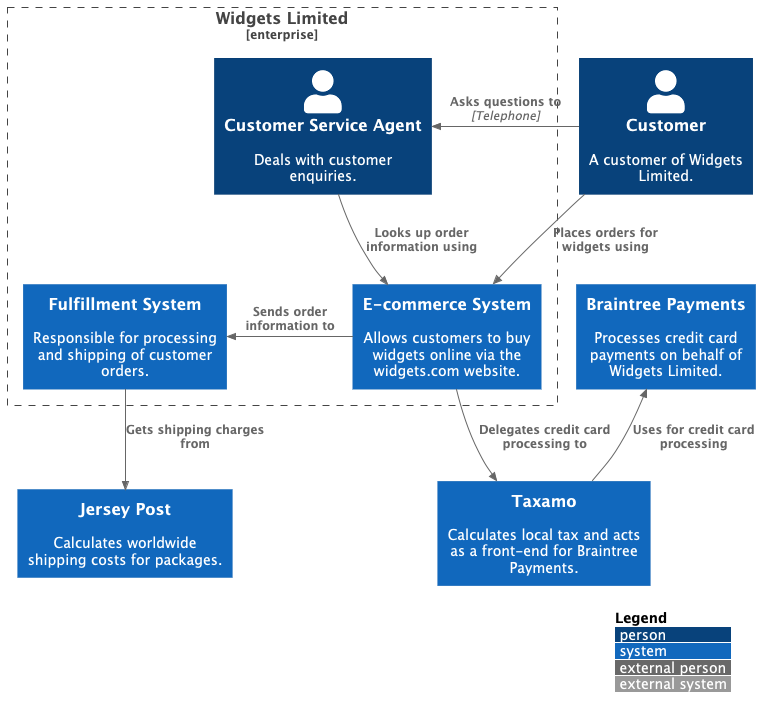
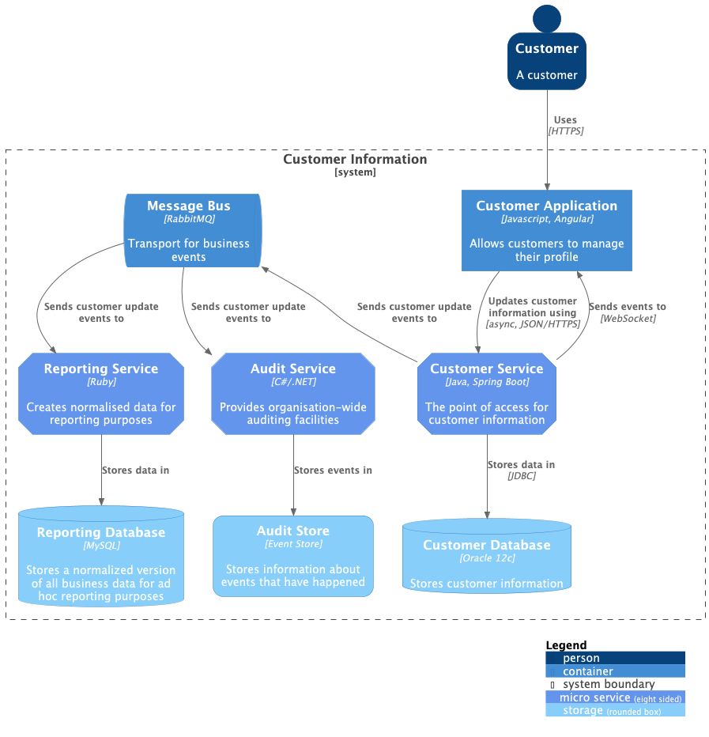
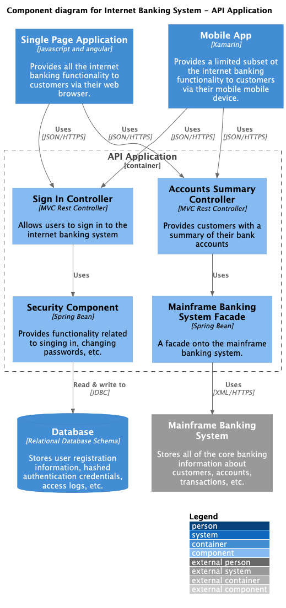

# c4-diagrams

[](https://img.shields.io/github/v/release/sidorov-as/c4-diagrams)
[](https://github.com/sidorov-as/c4-diagrams/actions/workflows/main.yml?query=branch%3Amain)
[](https://codecov.io/gh/sidorov-as/c4-diagrams)
[](https://img.shields.io/github/commit-activity/m/sidorov-as/c4-diagrams)
[](https://img.shields.io/github/license/sidorov-as/c4-diagrams)

**c4-diagrams** is a Python DSL for defining C4 architecture diagrams as code.

It provides first-class abstractions for C4 entities—people, systems, containers, components, boundaries, and
relationships — with rendering support for several backends:

- [PlantUML](https://github.com/plantuml-stdlib/C4-PlantUML)
  - local rendering using plantuml or plantuml.jar
  - remote rendering using PlantUML server
- [Mermaid](https://mermaid.js.org/syntax/c4.html) (WIP)
- [Structurizr](https://structurizr.com/) (WIP)

## Getting started

**c4-diagrams** requires **Python 3.10** or higher.

```shell
# using pip (pip3)
$ pip install c4-diagrams

# using pipenv
$ pipenv install c4-diagrams

# using poetry
$ poetry add c4-diagrams

# using uv
$ uv add c4-diagrams
```

You can start with [quick start](https://sidorov-as.github.io/c4-diagrams/getting-started/installation#quick-start).
[Read the docs](https://sidorov-as.github.io/c4-diagrams/) for more details.

## Examples


| System context diagram                                    | Container Diagram                                       | Component Diagram                                       |
|-----------------------------------------------------------|---------------------------------------------------------|---------------------------------------------------------|
|  |  |  |

## Project Links

- [**PyPI**](https://pypi.org/project/c4-diagrams/)
- [**GitHub**](https://github.com/sidorov-as/c4-diagrams/)
- [**Documentation**](https://sidorov-as.github.io/c4-diagrams/)
- [**Changelog**](https://github.com/sidorov-as/c4-diagrams/tree/main/CHANGELOG.md)

## License

* [MIT LICENSE](LICENSE)

## Contribution

[Contribution guidelines for this project](CONTRIBUTING.md)

---

Repository initiated with [fpgmaas/cookiecutter-uv](https://github.com/fpgmaas/cookiecutter-uv).
