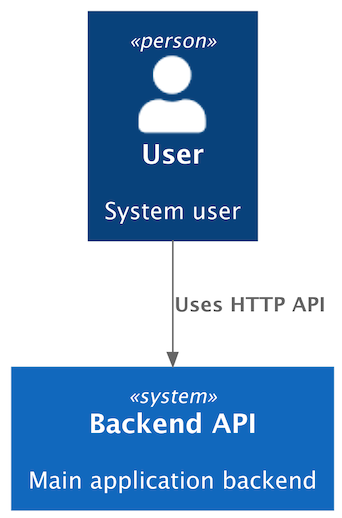

```python
# diagram.py
from c4 import Person, Rel, System, SystemContextDiagram

with SystemContextDiagram() as diagram:
    user = Person(label="User", description="System user")
    backend = System(label="Backend API", description="Main application backend")

    user >> Rel("Uses HTTP API") >> backend
```

<br/>

To render the diagram to text (by default, PlantUML source), run:

```shell
c4 render diagram.py > diagram.puml
```

<details>
<summary>Generated PlantUML source</summary>

```puml
@startuml
' convert it with additional command line argument -DRELATIVE_INCLUDE="relative/absolute" to use locally
!if %variable_exists("RELATIVE_INCLUDE")
    !include %get_variable_value("RELATIVE_INCLUDE")/C4_Context.puml
!else
    !include https://raw.githubusercontent.com/plantuml-stdlib/C4-PlantUML/master/C4_Context.puml
!endif

Person(user_a467, "User", "System user")

System(backend_api_8c20, "Backend API", "Main application backend")

Rel(user_a467, backend_api_8c20, "Uses HTTP API")

@enduml
```

</details>

<br/>

To export the diagram to a rendered artifact (by default, PNG format), run:

```shell
c4 export diagram.py > diagram.png
```

This generates the diagram below:

<figure markdown="span">
  { width="300" }
  <figcaption>diagram.png</figcaption>
</figure>

## CLI Reference

### c4 render

Render a diagram to text output (by default, PlantUML source).

**Usage:**

```shell
c4 render [-h] [-o OUTPUT] [--renderer {plantuml} | --plantuml] target
```

**Arguments:**

| Name     | Type   | Description                                                             |
|----------|--------|-------------------------------------------------------------------------|
| `target` | string | Diagram target: `file.py`, `file.py:diagram`, or `module.path:diagram`. |

**Options**:

| Name                                                       | Type                | Description                                                                                             | Default    |
|------------------------------------------------------------|---------------------|---------------------------------------------------------------------------------------------------------|------------|
| `--renderer`                                               | choice (`plantuml`) | Renderer to use (overrides the diagram's default renderer).                                             | `plantuml` |
| `--plantuml`                                               | boolean             | Use PlantUML renderer <br/> (alias for <span style="white-space: nowrap;">`--renderer plantuml`</span>) | False      |
| <span style="white-space: nowrap;">`-o`, `--output`</span> | path                | Redirect output to a file.                                                                              | stdout     |
| `-h`, `--help`                                             | boolean             | Show this help message and exit.                                                                        | False      |

<br/>

### c4 export

Export a diagram to a rendered artifact (e.g., PNG or SVG).

The available formats depend on the selected `renderer`.

**Usage:**

```shell
c4 export [-h] [-o OUTPUT] [-f {eps,latex,png,svg,txt,utxt}] \
          [--timeout TIMEOUT] \
          [--renderer {plantuml} | --plantuml] \
          [--plantuml-backend {local,remote}] \
          [--plantuml-server-url PLANTUML_SERVER_URL] \
          [--plantuml-bin PLANTUML_BIN | --plantuml-jar PLANTUML_JAR] \
          [--java-bin JAVA_BIN] \
          [--plantuml-skinparam-dpi PLANTUML_SKINPARAM_DPI] \
          target
```

**Arguments:**

| Name     | Type   | Description                                                             |
|----------|--------|-------------------------------------------------------------------------|
| `target` | string | Diagram target: `file.py`, `file.py:diagram`, or `module.path:diagram`. |

**Options**:

| Name                                                       | Type                                                 | Description                                                                                                          | Default    |
|------------------------------------------------------------|------------------------------------------------------|----------------------------------------------------------------------------------------------------------------------|------------|
| <span style="white-space: nowrap;">`-f`, `--format`</span> | choice (`eps`, `latex`, `png`, `svg`, `txt`, `utxt`) | Output format (render-specific).<br/>Supported formats:<br/>`plantuml`: `eps`, `latex`, `png`, `svg`, `txt`, `utxt`. | `png`      |
| `--timeout`                                                | integer                                              | Render timeout in seconds.<br/>Can also be set via the `RENDERING_TIMEOUT_SECONDS` environment variable.             | 30         |
| `--renderer`                                               | choice (`plantuml`)                                  | Renderer to use (overrides the diagram's default renderer).                                                          | `plantuml` |
| `--plantuml`                                               | boolean                                              | Use PlantUML renderer <br/> (alias for <span style="white-space: nowrap;">`--renderer plantuml`</span>).             | False      |
| <span style="white-space: nowrap;">`-o`, `--output`</span> | path                                                 | Redirect output to a file.                                                                                           | `stdout`   |
| `-h`, `--help`                                             | boolean                                              | Show this help message and exit.                                                                                     | False      |

**PlantUML Options**:

These options apply when using the plantuml renderer.

| Name                                                                 | Type                       | Description                                                                                                                                                                                                           | Default                                           |
|----------------------------------------------------------------------|----------------------------|-----------------------------------------------------------------------------------------------------------------------------------------------------------------------------------------------------------------------|---------------------------------------------------|
| <span style="white-space: nowrap;">`--plantuml-backend`</span>       | choice (`local`, `remote`) | How to run PlantUML: local execution or remote server.                                                                                                                                                                | `local`                                           |
| <span style="white-space: nowrap;">`--plantuml-server-url`</span>    | string                     | PlantUML server URL.<br/>If not provided, the `PLANTUML_SERVER_URL` environment variable will be used.                                                                                                                | [plantuml.com](https://www.plantuml.com/plantuml) |
| <span style="white-space: nowrap;">`--plantuml-bin`</span>           | string (path or command)   | PlantUML executable (command name or full path).<br/>If not provided, the `PLANTUML_BIN` environment variable will be used.                                                                                           | `plantuml`                                        |
| <span style="white-space: nowrap;">`--plantuml-jar`</span>           | path                       | Path to the PlantUML JAR file (runs via Java).<br/>If provided, the `PLANTUML_BIN` environment variable is ignored.<br/>Can also be set via the `PLANTUML_JAR` environment variable.                                  | None                                              |
| <span style="white-space: nowrap;">`--java-bin`</span>               | string (path or command)   | Java executable to use when running PlantUML via JAR.<br/>If not provided, the `JAVA_BIN` environment variable will be used.                                                                                          | `java`                                            |
| <span style="white-space: nowrap;">`--plantuml-skinparam-dpi`</span> | integer                    | Set PlantUML `skinparam dpi` value to control raster (PNG) resolution.<br/>This modifies diagram rendering and affects all output formats.<br/>Can also be set via the `PLANTUML_SKINPARAM_DPI` environment variable. | None                                              |
