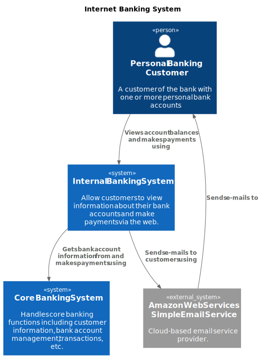
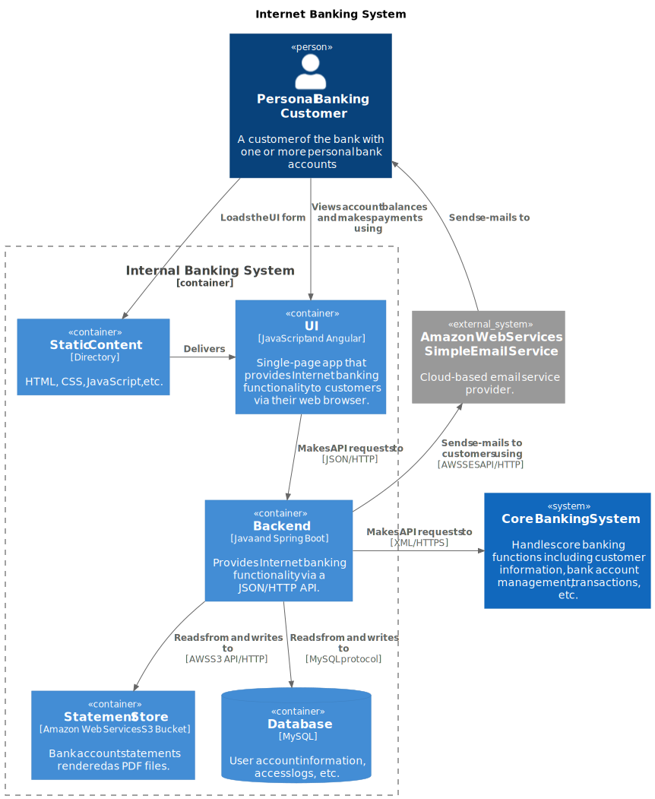

# Diagrams and components

!!! note

    You can find a detailed description of the different C4 diagram types and components in the
    corresponding sections of the [documentation](../diagrams/system-context.md).

## Diagrams


`Diagram` is a primary object representing a diagram.

```python
from c4.diagrams.core import Diagram

with Diagram("Simple Diagram") as diagram:
    # Declare diagram components here
```

Each C4 diagram type is implemented as a subclass of `Diagram`:

```python
from c4 import (
    SystemContextDiagram,
    SystemLandscapeDiagram,
    ContainerDiagram,
    ComponentDiagram,
    DynamicDiagram,
    DeploymentDiagram,
)
```

!!! note "Note"

    `Diagram` is a low-level abstraction and is not intended to be instantiated directly.

    Always use one of the concrete diagram classes (`SystemContextDiagram`,
    `ContainerDiagram`, `ComponentDiagram`, etc.), as they define the semantics,
    constraints, and rendering rules specific to each C4 diagram type.

<br/>

## Elements

`Element` represents a C4 abstraction such as a **System**, **Container**, or **Component**.

Elements must be declared within a diagram context:

```python
from c4.diagrams.core import Diagram, Element

with Diagram("Simple Diagram") as diagram:
    element1 = Element(label="Element 1")
    element2 = Element(label="Element 2")


assert diagram.elements == [element1, element2]
```

Each C4 component type is implemented as a subclass of  `Element`:

```python
from c4 import (
    Person,
    PersonExt,
    System,
    SystemDb,
    SystemDbExt,
    SystemExt,
    SystemQueue,
    SystemQueueExt,
    Component,
    ComponentDb,
    ComponentDbExt,
    ComponentExt,
    ComponentQueue,
    ComponentQueueExt,
    Container,
    ContainerDb,
    ContainerDbExt,
    ContainerExt,
    ContainerQueue,
    ContainerQueueExt,
    DeploymentNode,
    DeploymentNodeLeft,
    DeploymentNodeRight,
    Node,
    NodeLeft,
    NodeRight,
)
```

<br/>

## Relationships

`Relationship` represents a connection between elements and may include additional
properties such as direction and label.

A relationship object contains four primary attributes: **label**, **relationship_type**,
**from_element**, and **to_element**.

There are shortcut classes for different relationship types and directions:

```python
from c4.diagrams.core import (
    Rel,
    RelL,
    RelLeft,
    RelR,
    RelRight,
    RelU,
    RelUp,
    RelD,
    RelDown,
    RelNeighbor,
    BiRel,
    BiRelD,
    BiRelDown,
    BiRelL,
    BiRelLeft,
    BiRelNeighbor,
    BiRelR,
    BiRelRight,
    BiRelU,
    BiRelUp,
    RelBack,
    RelBackNeighbor,
)
```

Relationships must be declared within a diagram context:

```python
from c4.diagrams.core import Diagram, Element, Rel

with Diagram("Simple Diagram") as diagram:
    element1 = Element(label="Element 1")
    element2 = Element(label="Element 2")

    element1 >> Rel("Uses") >> element2


assert diagram.relationships[0].label == "Uses"
assert diagram.relationships[0].from_element == element1
assert diagram.relationships[0].to_element == element2
```

<br/>

There are several ways to declare relationships:

#### Simple cases

A relationship can be declared using its **label**:

```python
from c4.diagrams.core import Diagram, Element

with Diagram("Simple Diagram") as diagram:
    element1 = Element(label="Element 1")
    element2 = Element(label="Element 2")

    element1 >> "Uses" >> element2
```

Alternatively, a relationship can be declared using an explicit relationship object:

```python
from c4.diagrams.core import Diagram, Element, Rel

with Diagram("Simple Diagram") as diagram:
    element1 = Element(label="Element 1")
    element2 = Element(label="Element 2")

    element1 >> Rel("Uses") >> element2
```

??? note "Rel attributes"

    `Rel` (and other `Relationship` subclasses like `RelUp`, `RelLeft`, etc.)
    lets you specify additional relationship attributes such as `technology`,
    `description`, `link`, and `tags`.

    In most cases, a plain string label (`"Uses"`) is enough.

Using the pipe syntax:

```python
from c4.diagrams.core import Diagram, Element

with Diagram("Simple Diagram") as diagram:
    element1 = Element(label="Element 1")
    element2 = Element(label="Element 2")

    element1 >> element2 | "Uses"
```

Or by calling the method:

```python
from c4.diagrams.core import Diagram, Element

with Diagram("Simple Diagram") as diagram:
    element1 = Element(label="Element 1")
    element2 = Element(label="Element 2")

    element1.uses(element2, label="Uses")
```

All syntaxes above produce the same `Relationship` in the diagram.

<br/>

#### Reversed direction

```python
from c4.diagrams.core import Diagram, Element, Rel

with Diagram("Simple Diagram") as diagram:
    element1 = Element(label="Element 1")
    element2 = Element(label="Element 2")

    element2 << Rel("Uses") << element1
```

Or by calling the method:

```python
from c4.diagrams.core import Diagram, Element

with Diagram("Simple Diagram") as diagram:
    element1 = Element(label="Element 1")
    element2 = Element(label="Element 2")

    element2.used_by(element1, label="Uses")
```

<br/>

#### One-to-many relationships

```python
from c4.diagrams.core import Diagram, Element, Rel

with Diagram("Simple Diagram") as diagram:
    element1 = Element(label="Element 1")
    element2 = Element(label="Element 2")
    element3 = Element(label="Element 3")

    element1 >> Rel("Uses") >> [element2, element3]

assert diagram.relationships[0].label == "Uses"
assert diagram.relationships[0].from_element == element1
assert diagram.relationships[0].to_element == element2
assert diagram.relationships[1].label == "Uses"
assert diagram.relationships[1].from_element == element1
assert diagram.relationships[1].to_element == element3
```

or reversed:

```python
from c4.diagrams.core import Diagram, Element, Rel

with Diagram("Simple Diagram") as diagram:
    element1 = Element(label="Element 1")
    element2 = Element(label="Element 2")
    element3 = Element(label="Element 3")

    [element2, element3] << Rel("Uses") << element1
```

<br/>

#### Many-to-one relationships

```python
from c4.diagrams.core import Diagram, Element, Rel

with Diagram("Simple Diagram") as diagram:
    element1 = Element(label="Element 1")
    element2 = Element(label="Element 2")
    element3 = Element(label="Element 3")

    [element2, element3] >> Rel("Uses") >> element1
```

or reversed:

```python
from c4.diagrams.core import Diagram, Element, Rel

with Diagram("Simple Diagram") as diagram:
    element1 = Element(label="Element 1")
    element2 = Element(label="Element 2")
    element3 = Element(label="Element 3")

    element1 << Rel("Uses") << [element2, element3]
```

<br/>

## Boundaries

`Boundary` allows grouping (or clustering) elements into an isolated logical container.

Elements that belong to a boundary must be created within a boundary context:

```python
from c4.diagrams.core import Diagram, Element, Boundary, Rel

with Diagram("Simple Diagram") as diagram:
    element1 = Element(label="Element 1")

    with Boundary(label="Boundary") as boundary:
       element2 = Element(label="Element 2")
       element3 = Element(label="Element 3")

    element1 >> Rel("Uses") >> [element2, element3]

assert diagram.elements == [element1, element2]
```

There are several types of boundaries:

```python
from c4 import (
    SystemBoundary,
    ContainerBoundary,
    EnterpriseBoundary,
    Node,
    NodeLeft,
    NodeRight,
    DeploymentNode,
    DeploymentNodeLeft,
    DeploymentNodeRight,
)
```

## Examples

You can find all the examples on the [examples](../examples/plantuml.md) page.

### System context diagram

```python
from c4 import SystemContextDiagram, Person, System, SystemExt

with SystemContextDiagram("Internet Banking System") as diagram:
    client = Person(
        label="Personal Banking Customer",
        description="A customer of the bank with one or more personal bank accounts"
    )
    banking_system = System(
        label="Internal Banking System",
        description=(
            "Allow customers to view information about their bank accounts "
            "and make payments via the web."
        )
    )
    aws_email = SystemExt(
        label="Amazon Web Services Simple Email Service",
        description="Cloud-based email service provider."
    )
    core_banking_system = System(
        label="Core Banking System",
        description=(
            "Handles core banking functions including customer information, "
            "bank account management, transactions, etc."
        )
    )

    client >> "Views account balances and makes payments using" >> banking_system
    banking_system >> "Sends e-mails to customers using" >> aws_email
    aws_email >> "Sends e-mails to" >> client
    banking_system >> "Gets bank account information from and makes payments using" >> core_banking_system
```

The diagram above can be rendered into the following PlantUML diagram:




### Container diagram

```python
from c4 import (
    ContainerDiagram,
    Person,
    System,
    SystemExt,
    ContainerBoundary,
    Container,
    ContainerDb,
    Rel,
    RelDown,
    RelRight,
    RelUp,
    RelLeft,
)

with ContainerDiagram("Internet Banking System") as diagram:
    client = Person(
        label="Personal Banking Customer",
        description="A customer of the bank with one or more personal bank accounts"
    )
    aws_email = SystemExt(
        label="Amazon Web Services Simple Email Service",
        description="Cloud-based email service provider."
    )
    core_banking_system = System(
        label="Core Banking System",
        description=(
            "Handles core banking functions including customer information, "
            "bank account management, transactions, etc."
        )
    )

    with ContainerBoundary(label="Internal Banking System"):
        static = Container(
            label="Static Content",
            technology="Directory",
            description="HTML, CSS, JavaScript, etc.",

        )
        ui = Container(
            label="UI",
            technology="JavaScript and Angular",
            description=(
                "Single-page app that provides Internet banking functionality "
                "to customers via their web browser."
            ),
        )
        backend = Container(
            label="Backend",
            technology="Java and Spring Boot",
            description=(
                "Provides Internet banking functionality via a JSON/HTTP API."
            )
        )
        statement_store = Container(
            label="Statement Store",
            technology="Amazon Web Services S3 Bucket",
            description="Bank account statements rendered as PDF files."
        )
        db = ContainerDb(
            label="Database",
            technology="MySQL",
            description="User account information, access logs, etc.",
        )

    client >> RelDown("Loads the UI form" ) >> static
    client >> RelDown("Views account balances and makes payments using" ) >> ui
    static >> RelRight("Delivers") >> ui
    backend >> RelLeft("Sends e-mails to customers using", technology="AWS SES API/HTTP") >> aws_email
    aws_email >> RelUp("Sends e-mails to") >> client
    ui >> Rel("Makes API requests to", technology="JSON/HTTP") >> backend
    backend >> RelRight("Makes API requests to", technology="XML/HTTPS") >> core_banking_system
    backend >> Rel("Reads from and writes to", technology="MySQL protocol") >> db
    backend >> Rel("Reads from and writes to", technology="AWS S3 API/HTTP") >> statement_store
```

The diagram above can be rendered into the following PlantUML diagram:


