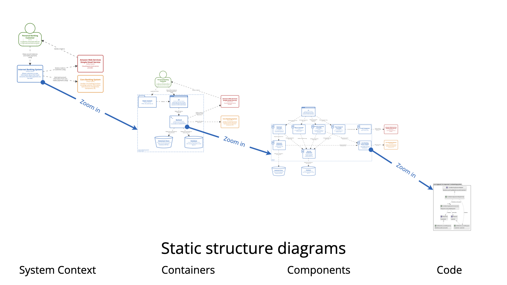
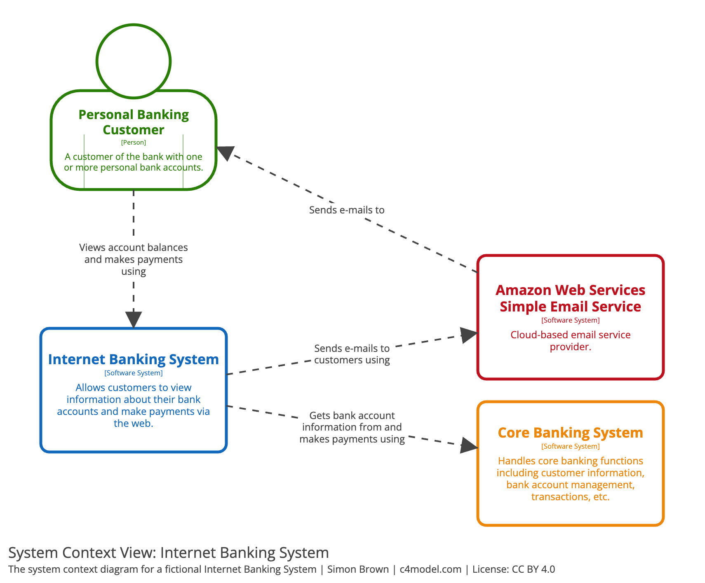
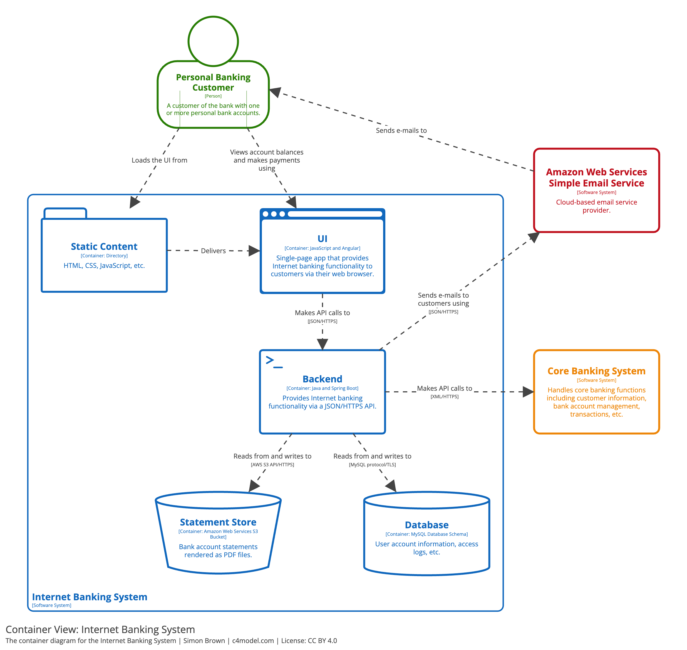
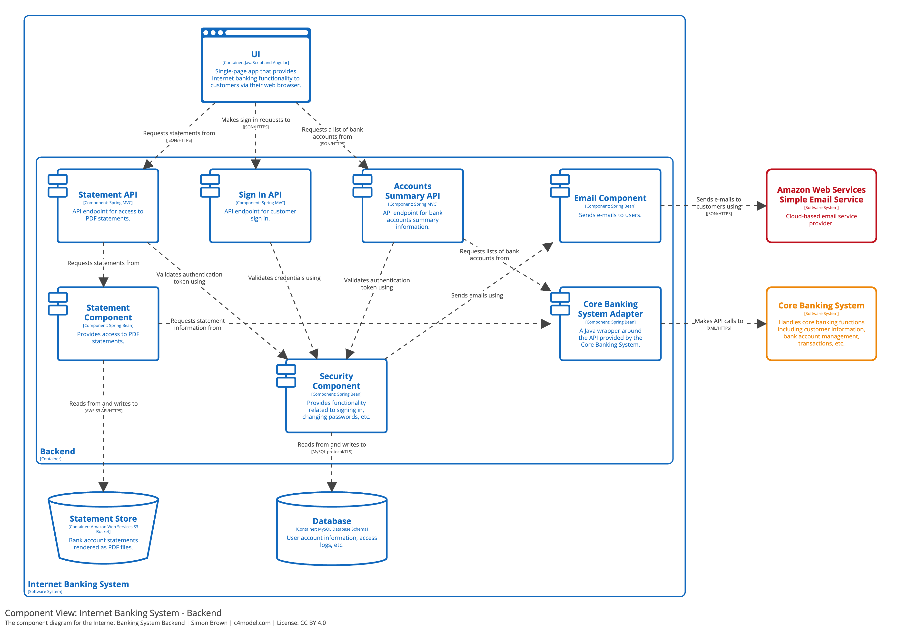

# Introduction

The C4 model is named after the core set of static structure diagrams:

- (system) context
- containers
- components
- code

Multiple zoom levels enable presenting the system from perspectives appropriate to different audiences.
However, using all four diagram types is rarely required — system context and container diagrams are
usually enough for most teams.

| [System context diagram](https://c4model.com/diagrams/system-context) | [Container Diagram](https://c4model.com/diagrams/container) | [Component Diagram](https://c4model.com/diagrams/component) |
|-----------------------------------------------------------------------|-------------------------------------------------------------|-------------------------------------------------------------|
|              |      |      |
