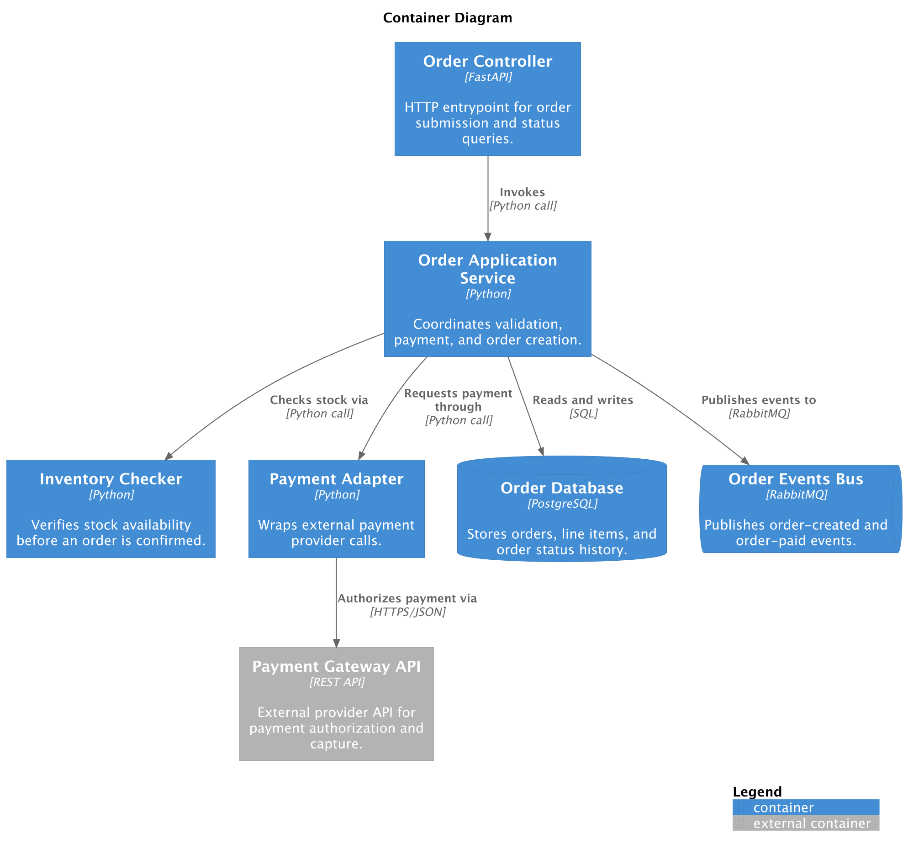

# JSON to Diagram Converter

Diagrams can be defined in a **JSON format** as an alternative to the Python DSL.

This feature allows you to **generate diagrams from structured data** instead of writing Python code,
making diagram creation more flexible, deterministic, and easier to automate.

## Why JSON?

The primary purpose of this feature is to decouple diagram definition from Python code and enable
diagram generation from external sources.

This approach is especially useful in the following scenarios:

### 1. Deterministic diagram generation (LLMs, automation)

JSON provides a **strict and predictable schema**, which makes it ideal for:

- Generating diagrams with **LLMs (AI agents)**
- Ensuring **consistent output across runs**

Instead of asking an LLM to write Python DSL (which may vary),
you can require it to produce **valid JSON conforming to a schema**.

### 2. Infrastructure and service introspection

JSON diagrams can be generated automatically by analyzing your system configuration:

- Docker / Docker Compose configurations
- Kubernetes manifests (Deployments, Services, etc.)
- Cloud infrastructure definitions
- Internal service metadata

This enables **automatic architecture visualization** without manual diagram maintenance.

### 3. Service catalogs and metadata-driven diagrams

Teams can define architecture using **declarative metadata files**, for example:

- `catalog-info.yaml` (similar to [Backstage](https://backstage.io/docs/features/software-catalog/descriptor-format/) and [Open edX](https://docs.openedx.org/projects/openedx-proposals/en/latest/processes/oep-0055/decisions/0001-use-backstage-to-support-maintainers.html#references))
- Custom service manifests in each repository

These files may describe:

- Service name and purpose
- Components (API, workers, schedulers, etc.)
- Dependencies and relationships

From this metadata, you can generate a **JSON diagram**, which is then rendered into a C4 diagram.

## Supported Diagram Types

Each diagram type has its own JSON specification:

- [SystemContextDiagram](specs/system_context_diagram.md)
- [SystemLandscapeDiagram](specs/system_landscape_diagram.md)
- [ContainerDiagram](specs/container_diagram.md)
- [ComponentDiagram](specs/component_diagram.md)
- [DeploymentDiagram](specs/deployment_diagram.md)
- [DynamicDiagram](specs/dynamic_diagram.md)


### Example: System Context Diagram (JSON)

```json
{
  "type": "SystemContextDiagram",
  "elements": [
    {
      "type": "Person",
      "alias": "user",
      "label": "User",
      "description": "System user"
    },
    {
      "type": "System",
      "alias": "app",
      "label": "Backend API",
      "description": "Main application backend"
    }
  ],
  "relationships": [
    {
      "type": "REL",
      "from": "user",
      "to": "app",
      "label": "Uses HTTP API"
    }
  ]
}
```

### Converting JSON to Python DSL

JSON diagrams are treated the same as Python-based diagrams and can be rendered or exported using the same tooling.

To convert a JSON diagram into Python DSL, run:

```shell
c4 convert diagram.json --json-to-py > diagram.py
```

This generates:

```python
# diagram.py
from c4 import (
    Person,
    Rel,
    System,
    SystemContextDiagram,
)

with SystemContextDiagram():
    user = Person('User', 'System user', alias='user')
    app = System('Backend API', 'Main application backend', alias='app')

    user >> Rel('Uses HTTP API') >> app
```

## How JSON diagrams can be generated

The following example shows how architecture information can be extracted from a `docker-compose.yaml` file:


??? abstract "Compose file"

    ```yaml
    version: "3.9"
    name: "Order Processing API"

    services:
      order_controller:
        image: python:3.12-slim
        container_name: order_controller
        command: ["sh", "-c", "echo starting order_controller && sleep infinity"]
        depends_on:
          - order_app_service
        ports:
          - "8000:8000"
        labels:
          c4.type: "Container"
          c4.label: "Order Controller"
          c4.technology: "FastAPI"
          c4.description: "HTTP entrypoint for order submission and status queries."
          c4.tags: "Entrypoint,CoreComponent"

          c4.rel.order_app_service.label: "Invokes"
          c4.rel.order_app_service.technology: "Python call"
          c4.rel.order_app_service.tags: "SyncCall"

      order_app_service:
        image: python:3.12-slim
        container_name: order_app_service
        command: ["sh", "-c", "echo starting order_app_service && sleep infinity"]
        depends_on:
          - inventory_checker
          - payment_adapter
          - order_db
          - order_events_bus
        labels:
          c4.type: "Container"
          c4.label: "Order Application Service"
          c4.technology: "Python"
          c4.description: "Coordinates validation, payment, and order creation."
          c4.tags: "CoreComponent,Orders"

          c4.rel.inventory_checker.label: "Checks stock via"
          c4.rel.inventory_checker.technology: "Python call"
          c4.rel.inventory_checker.tags: "SyncCall"

          c4.rel.payment_adapter.label: "Requests payment through"
          c4.rel.payment_adapter.technology: "Python call"
          c4.rel.payment_adapter.tags: "SyncCall"

          c4.rel.order_db.label: "Reads and writes"
          c4.rel.order_db.technology: "SQL"
          c4.rel.order_db.tags: "DataAccess"

          c4.rel.order_events_bus.label: "Publishes events to"
          c4.rel.order_events_bus.technology: "RabbitMQ"
          c4.rel.order_events_bus.tags: "AsyncFlow"

      inventory_checker:
        image: python:3.12-slim
        container_name: inventory_checker
        command: ["sh", "-c", "echo starting inventory_checker && sleep infinity"]
        labels:
          c4.type: "Container"
          c4.label: "Inventory Checker"
          c4.technology: "Python"
          c4.description: "Verifies stock availability before an order is confirmed."
          c4.tags: "CoreComponent"

      payment_adapter:
        image: python:3.12-slim
        container_name: payment_adapter
        command: ["sh", "-c", "echo starting payment_adapter && sleep infinity"]
        depends_on:
          - payment_gateway_api
        labels:
          c4.type: "Container"
          c4.label: "Payment Adapter"
          c4.technology: "Python"
          c4.description: "Wraps external payment provider calls."
          c4.tags: "CoreComponent,Payments"

          c4.rel.payment_gateway_api.label: "Authorizes payment via"
          c4.rel.payment_gateway_api.technology: "HTTPS/JSON"
          c4.rel.payment_gateway_api.tags: "ExternalCall"

      order_db:
        image: postgres:16
        container_name: order_db
        environment:
          POSTGRES_DB: orders
          POSTGRES_USER: orders
          POSTGRES_PASSWORD: orders
        ports:
          - "5432:5432"
        volumes:
          - order_db_data:/var/lib/postgresql/data
        labels:
          c4.type: "ContainerDb"
          c4.label: "Order Database"
          c4.technology: "PostgreSQL"
          c4.description: "Stores orders, line items, and order status history."
          c4.tags: "ComponentDatabase"

      order_events_bus:
        image: rabbitmq:3.13-management
        container_name: order_events_bus
        ports:
          - "5672:5672"   # AMQP
          - "15672:15672" # Management UI
        labels:
          c4.type: "ContainerQueue"
          c4.label: "Order Events Bus"
          c4.technology: "RabbitMQ"
          c4.description: "Publishes order-created and order-paid events."
          c4.tags: "AsyncComponent"

      payment_gateway_api:
        image: nginx:alpine
        container_name: payment_gateway_api
        command: ["sh", "-c", "echo 'mock gateway' > /usr/share/nginx/html/index.html && nginx -g 'daemon off;'"]
        ports:
          - "8080:80"
        labels:
          c4.type: "ContainerExt"
          c4.label: "Payment Gateway API"
          c4.technology: "REST API"
          c4.description: "External provider API for payment authorization and capture."
          c4.tags: "ExternalComponent"

    volumes:
      order_db_data:
    ```

??? abstract "Diagram generator"

    ```python
    import yaml


    def parse_kv_list(value: str | None) -> list[str]:
        if not value:
            return []
        return [v.strip() for v in value.split(",") if v.strip()]


    def parse_labels(raw_labels) -> dict:
        if isinstance(raw_labels, list):
            # ["key=value"]
            result = {}
            for item in raw_labels:
                k, v = item.split("=", 1)
                result[k] = v
            return result
        return raw_labels or {}


    def parse_compose(file_path: str) -> dict:
        compose = yaml.safe_load(open(file_path))
        services = compose["services"]
        title = compose.get("name", "Container Diagram")

        elements = []
        relationships = []

        for name, service in services.items():
            labels = parse_labels(service.get("labels"))

            element_type = labels.get("c4.type", "Container")

            elements.append({
                "type": element_type,
                "alias": name,
                "label": labels.get("c4.label", name),
                "technology": labels.get("c4.technology"),
                "description": labels.get("c4.description", "Docker service"),
                "tags": parse_kv_list(labels.get("c4.tags")),
            })

            # relationships
            for dep in service.get("depends_on", []):
                rel_prefix = f"c4.rel.{dep}"

                relationships.append({
                    "type": "REL",
                    "from": name,
                    "to": dep,
                    "label": labels.get(f"{rel_prefix}.label", "Depends on"),
                    "technology": labels.get(f"{rel_prefix}.technology"),
                    "tags": parse_kv_list(labels.get(f"{rel_prefix}.tags")),
                })

        return {
            "type": "ContainerDiagram",
            "title": title,
            "elements": elements,
            "relationships": relationships,
            "render_options": {
                "plantuml": {
                    "show_legend": {
                        "details": "Normal",
                        "hide_stereotype": True
                    },
                }
            }
        }
    ```

This generates the diagram below:

<figure markdown="span">
  
  <figcaption>docker-compose-diagram</figcaption>
</figure>
