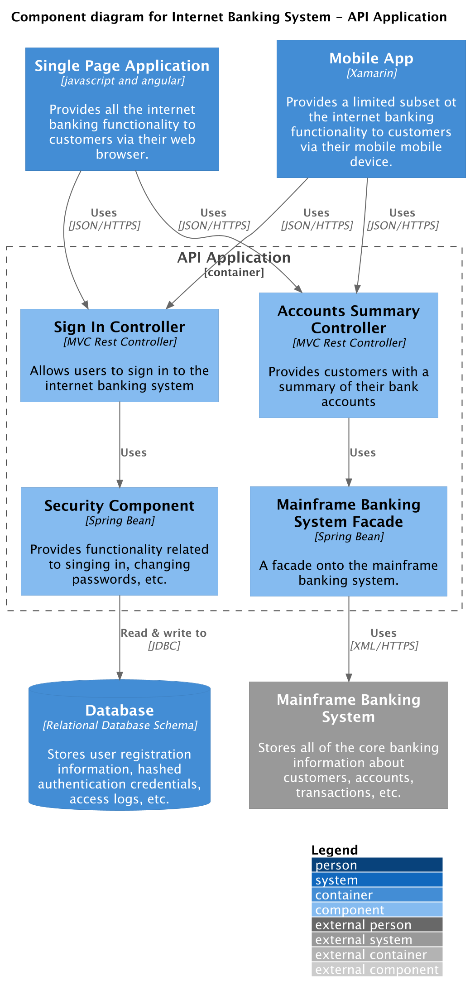

# Component diagram

Next you can zoom in and decompose a container to describe the [components](https://c4model.com/abstractions/component)
that reside inside it;
including their responsibilities and the technology/implementation details.

## Example

The following example demonstrates how to define a **component diagram** using the Python DSL.

```python
from c4 import (
    Component,
    ComponentDiagram,
    Container,
    ContainerBoundary,
    ContainerDb,
    Rel,
    SystemExt,
)
from c4.renderers.plantuml import LayoutOptions

with ComponentDiagram(
    title="Component diagram for Internet Banking System - API Application"
) as diagram:
    spa = Container(
        "spa",
        "Single Page Application",
        "javascript and angular",
        "Provides all the internet banking functionality to customers via their web browser.",
    )
    ma = Container(
        "ma",
        "Mobile App",
        "Xamarin",
        "Provides a limited subset ot the internet banking functionality to customers via their mobile mobile device.",
    )
    db = ContainerDb(
        "db",
        "Database",
        "Relational Database Schema",
        "Stores user registration information, hashed authentication credentials, access logs, etc.",
    )
    mbs = SystemExt(
        "mbs",
        "Mainframe Banking System",
        "Stores all of the core banking information about customers, accounts, transactions, etc.",
    )

    with ContainerBoundary("api", "API Application"):
        sign = Component(
            "sign",
            "Sign In Controller",
            "MVC Rest Controller",
            "Allows users to sign in to the internet banking system",
        )
        accounts = Component(
            "accounts",
            "Accounts Summary Controller",
            "MVC Rest Controller",
            "Provides customers with a summary of their bank accounts",
        )
        security = Component(
            "security",
            "Security Component",
            "Spring Bean",
            "Provides functionality related to singing in, changing passwords, etc.",
        )
        mbsfacade = Component(
            "mbsfacade",
            "Mainframe Banking System Facade",
            "Spring Bean",
            "A facade onto the mainframe banking system.",
        )

        sign >> Rel("Uses") >> security
        accounts >> Rel("Uses") >> mbsfacade
        security >> Rel("Read & write to", "JDBC") >> db
        mbsfacade >> Rel("Uses", "XML/HTTPS") >> mbs

    spa >> Rel("Uses", "JSON/HTTPS") >> sign
    spa >> Rel("Uses", "JSON/HTTPS") >> accounts

    ma >> Rel("Uses", "JSON/HTTPS") >> sign
    ma >> Rel("Uses", "JSON/HTTPS") >> accounts

    layout_config = LayoutOptions().layout_with_legend().build()

diagram_code = diagram.as_plantuml(layout_config=layout_config)
```

<details>
<summary>Generated PlantUML source</summary>

```puml

```

</details>

The PlantUML source can be rendered into the following diagram:


