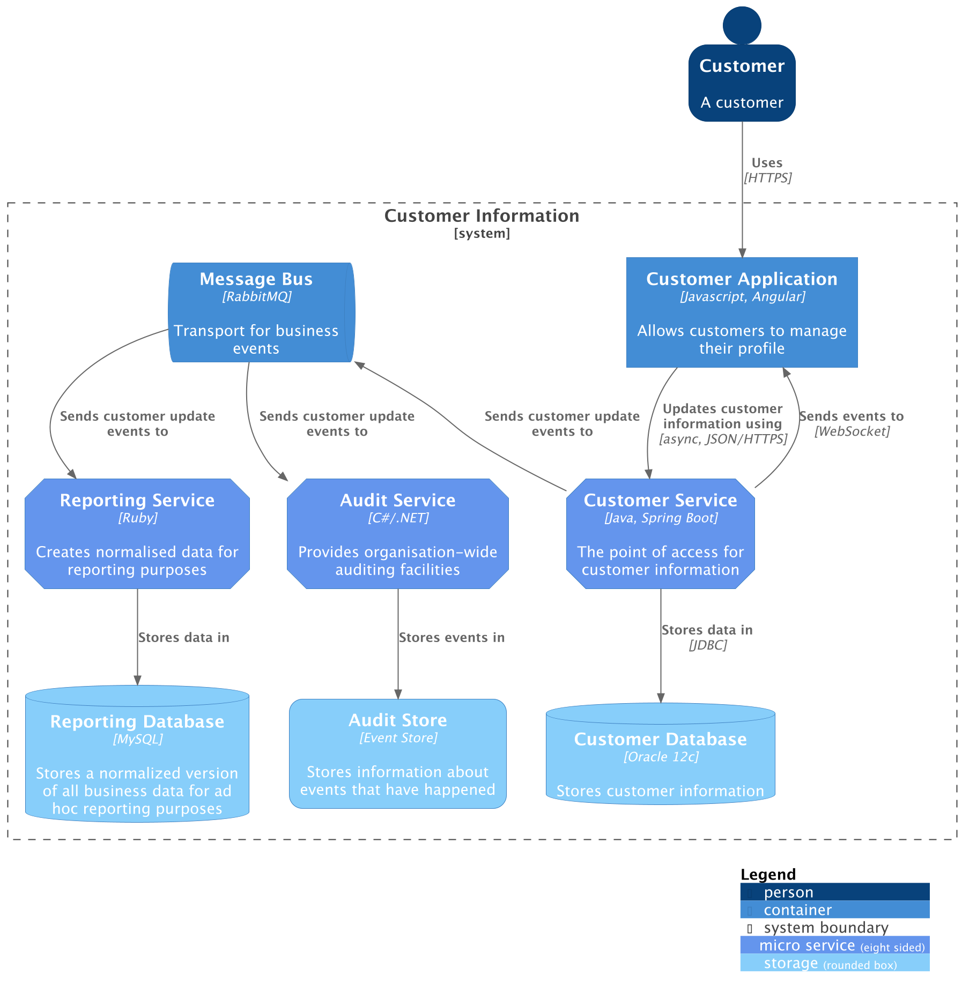

# Container diagram

Once you understand how your system fits in to the overall IT environment, a useful next step is to zoom in to the
system boundary with a container diagram. In C4, a [container](https://c4model.com/abstractions/container)
is an application or a data store. For example, a
server-side web application, a client-side single-page application, a desktop application, a mobile app, a database
schema, a folder on a file system, an Amazon Web Services S3 bucket, etc.

The container diagram shows the high-level shape of the software architecture and how responsibilities are distributed
across it. It also shows the major technology choices and how the containers communicate with one another. It’s a
simple, high-level technology focussed diagram that is useful for software developers and support/operations staff
alike.


???+ warning "Containers with nested elements"

    In C4-PlantUML, containers can act as boundaries and contain nested elements.

    In **c4-diagrams**, containers and boundaries are intentionally modeled as **separate concepts**
    to ensure consistent behavior across different renderers.

    Because of this, containers cannot contain nested elements in the portable DSL.

    Support for this pattern may be introduced in the future as a **renderer-specific extension**
    (see [issue #12](https://github.com/sidorov-as/c4-diagrams/issues/12)).

    For now, use [`ContainerBoundary`][c4.diagrams.container.ContainerBoundary].

## Example

The following example demonstrates how to define a **container diagram** using the Python DSL.

```python
from c4 import (
    Container,
    ContainerDb,
    ContainerDiagram,
    ContainerQueue,
    LayRight,
    Person,
    Rel,
    RelDown,
    RelUp,
    SystemBoundary,
)
from c4.renderers.plantuml import PlantUMLRenderOptionsBuilder


with ContainerDiagram() as diagram:
    customer = Person("customer", "Customer", "A customer")

    with SystemBoundary("c1", "Customer Information"):
        app = Container(
            "app",
            "Customer Application",
            "Javascript, Angular",
            "Allows customers to manage their profile",
        )
        customer_service = Container(
            "customer_service",
            "Customer Service",
            "Java, Spring Boot",
            "The point of access for customer information",
            tags="microService",
        )
        message_bus = ContainerQueue(
            "message_bus",
            "Message Bus",
            "RabbitMQ",
            "Transport for business events",
        )
        reporting_service = Container(
            "reporting_service",
            "Reporting Service",
            "Ruby",
            "Creates normalised data for reporting purposes",
            tags="microService",
        )
        audit_service = Container(
            "audit_service",
            "Audit Service",
            "C#/.NET",
            "Provides organisation-wide auditing facilities",
            tags="microService",
        )
        customer_db = ContainerDb(
            "customer_db",
            "Customer Database",
            "Oracle 12c",
            "Stores customer information",
            tags="storage",
        )
        reporting_db = ContainerDb(
            "reporting_db",
            "Reporting Database",
            "MySQL",
            "Stores a normalized version of all business data for ad hoc reporting purposes",
            tags="storage",
        )
        audit_store = Container(
            "audit_store",
            "Audit Store",
            "Event Store",
            "Stores information about events that have happened",
            tags="storage",
        )

        customer >> RelDown("Uses", "HTTPS") >> app
        app >> RelDown('Updates customer information using', 'async, JSON/HTTPS') >> customer_service  # fmt: off

        customer_service >> RelUp("Sends events to", "WebSocket") >> app
        customer_service >> RelUp('Sends customer update events to') >> message_bus  # fmt: off

        customer_service >> Rel("Stores data in", "JDBC") >> customer_db

        message_bus >> Rel('Sends customer update events to') >> [reporting_service, audit_service]  # fmt: off

        reporting_service >> Rel("Stores data in") >> reporting_db
        audit_service >> Rel("Stores events in") >> audit_store

    LayRight(reporting_service, audit_service)

    render_options = (
        PlantUMLRenderOptionsBuilder()
        .add_element_tag(
            "microService",
            shape="EightSidedShape",
            bg_color="CornflowerBlue",
            font_color="white",
            legend_text="micro service\neight sided",
        )
        .add_element_tag(
            "storage",
            shape="RoundedBoxShape",
            bg_color="lightSkyBlue",
            font_color="white",
        )
        .show_person_outline()
        .show_legend()
        .build()
    )

diagram_code = diagram.as_plantuml(render_options=render_options)
```

<details>
<summary>Generated PlantUML source</summary>

```puml

```

</details>

The PlantUML source can be rendered into the following diagram:


