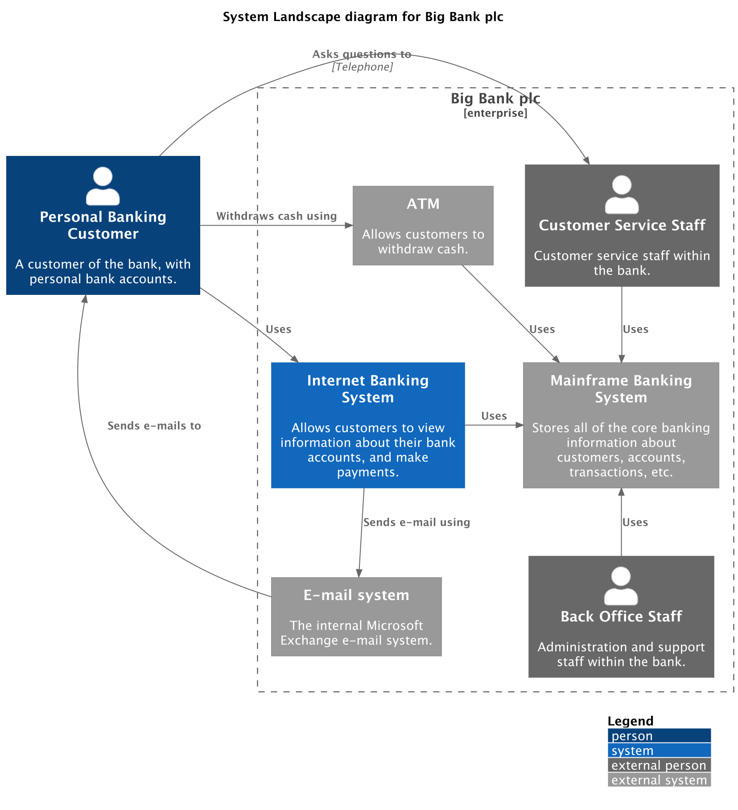
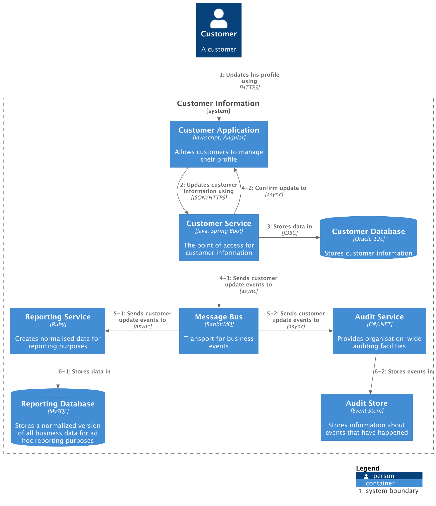
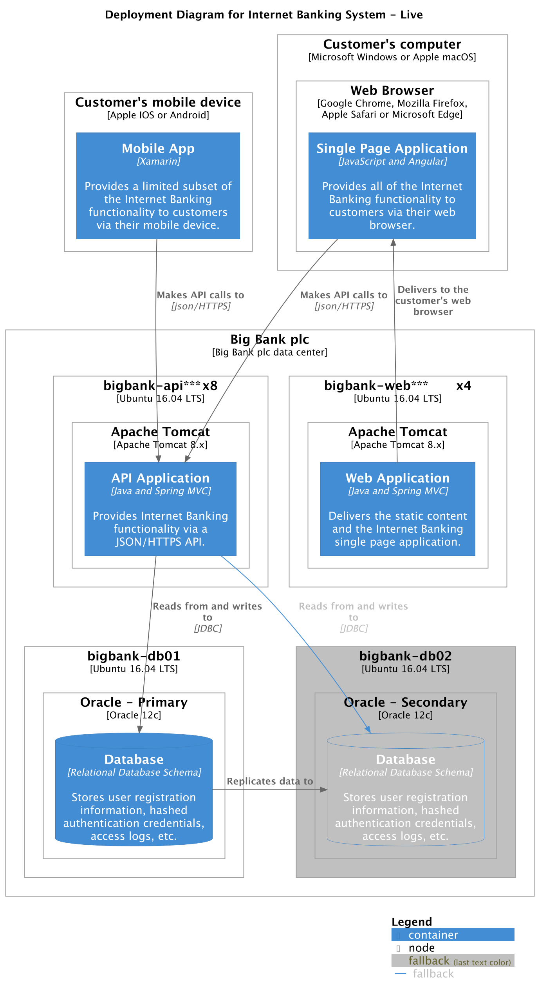

# Supporting diagrams

In addition, there are 3 supporting diagram types:

- [System landscape diagram](https://c4model.com/diagrams/system-landscape)
- [Dynamic diagram](https://c4model.com/diagrams/dynamic)
- [Deployment diagram](https://c4model.com/diagrams/deployment)

## System landscape diagram

The system context, container, component, and code diagrams are designed to provide a static view of a single software
system but, in the real-world, software systems never live in isolation.
For this reason, and particularly if you are responsible for a collection/portfolio of software systems,
it’s often useful to understand how all of these software systems fit together within a given enterprise,
organisation, department, etc. Essentially this is a map of the software systems within the chosen scope,
with a set of system context, container, component, and code diagrams for each software system of interest.

From a practical perspective, a system landscape diagram is really just a system context diagram without a specific
focus on a particular software system.

<details>
<summary>Python DSL</summary>

```python
from c4 import (
    EnterpriseBoundary,
    LayD,
    LayU,
    Person,
    PersonExt,
    RelBack,
    RelD,
    RelNeighbor,
    RelR,
    RelU,
    System,
    SystemExt,
    SystemLandscapeDiagram,
)
from c4.renderers.plantuml import LayoutOptions


with SystemLandscapeDiagram(
    title="System Landscape diagram for Big Bank plc"
) as diagram:
    customer = Person(
        "customer",
        "Personal Banking Customer",
        "A customer of the bank, with personal bank accounts.",
    )

    with EnterpriseBoundary("c0", "Big Bank plc"):
        banking_system = System(
            "banking_system",
            "Internet Banking System",
            "Allows customers to view information about their bank accounts, and make payments.",
        )

        atm = SystemExt("atm", "ATM", "Allows customers to withdraw cash.")
        mail_system = SystemExt(
            "mail_system",
            "E-mail system",
            "The internal Microsoft Exchange e-mail system.",
        )

        mainframe = SystemExt(
            "mainframe",
            "Mainframe Banking System",
            "Stores all of the core banking information about customers, accounts, transactions, etc.",
        )

        customer_service = PersonExt(
            "customer_service",
            "Customer Service Staff",
            "Customer service staff within the bank.",
        )
        back_office = PersonExt(
            "back_office",
            "Back Office Staff",
            "Administration and support staff within the bank.",
        )

    customer >> RelNeighbor("Uses") >> banking_system
    customer >> RelR("Withdraws cash using") >> atm
    customer >> RelBack("Sends e-mails to") >> mail_system

    customer >> RelR("Asks questions to", "Telephone") >> customer_service

    banking_system >> RelD("Sends e-mail using") >> mail_system
    atm >> RelR("Uses") >> mainframe
    banking_system >> RelR("Uses") >> mainframe
    customer_service >> RelD("Uses") >> mainframe
    back_office >> RelU("Uses") >> mainframe

    LayD(atm, banking_system)

    LayD(atm, customer)
    LayU(mail_system, customer)

    layout_config = LayoutOptions().layout_with_legend().build()

diagram_code = diagram.as_plantuml(layout_config=layout_config)
```

</details>

The PlantUML source can be rendered into the following diagram:




## Dynamic diagram

A dynamic diagram can be useful when you want to show how elements in the static model collaborate at runtime to
implement a user story, use case, feature, etc.
This dynamic diagram is based upon a [UML communication diagram](https://en.wikipedia.org/wiki/Communication_diagram)
(previously known as a “UML collaboration diagram”).
It is similar to a [UML sequence diagram](https://en.wikipedia.org/wiki/Sequence_diagram), although it allows a
free-form arrangement of diagram elements with numbered
interactions to indicate ordering.

<details>
<summary>Python DSL</summary>

```python
from c4 import (
    Container,
    ContainerDb,
    DynamicDiagram,
    Index,
    LastIndex,
    Person,
    Rel,
    RelDown,
    RelLeft,
    RelRight,
    RelUp,
    SetIndex,
    SystemBoundary,
)
from c4.renderers.plantuml import LayoutOptions


with DynamicDiagram() as diagram:
    customer = Person("customer", "Customer", "A customer")

    with SystemBoundary("c1", "Customer Information"):
        app = Container(
            "app",
            "Customer Application",
            "Javascript, Angular",
            "Allows customers to manage their profile",
        )
        customer_service = Container(
            "customer_service",
            "Customer Service",
            "Java, Spring Boot",
            "The point of access for customer information",
        )
        message_bus = Container(
            "message_bus",
            "Message Bus",
            "RabbitMQ",
            "Transport for business events",
        )
        reporting_service = Container(
            "reporting_service",
            "Reporting Service",
            "Ruby",
            "Creates normalised data for reporting purposes",
        )
        audit_service = Container(
            "audit_service",
            "Audit Service",
            "C#/.NET",
            "Provides organisation-wide auditing facilities",
        )
        customer_db = ContainerDb(
            "customer_db",
            "Customer Database",
            "Oracle 12c",
            "Stores customer information",
        )
        reporting_db = ContainerDb(
            "reporting_db",
            "Reporting Database",
            "MySQL",
            "Stores a normalized version of all business data for ad hoc reporting purposes",
        )
        audit_store = Container(
            "audit_store",
            "Audit Store",
            "Event Store",
            "Stores information about events that have happened",
        )

    customer >> RelDown("Updates his profile using", "HTTPS") >> app
    (
        app
        >> Rel("Updates customer information using", "JSON/HTTPS")
        >> customer_service
    )
    customer_service >> RelRight("Stores data in", "JDBC") >> customer_db

    (
        customer_service
        >> RelDown(
            "Sends customer update events to", "async", index=f"{Index()}-1"
        )
        >> message_bus
    )
    (
        customer_service
        >> RelUp("Confirm update to", "async", index=LastIndex() + "-2")
        >> app
    )

    (
        message_bus
        >> RelLeft(
            "Sends customer update events to", "async", index=f"{Index()}-1"
        )
        >> reporting_service
    )
    (
        reporting_service
        >> Rel("Stores data in", index=f"{Index()}-1")
        >> reporting_db
    )

    (
        message_bus
        >> RelRight(
            "Sends customer update events to",
            "async",
            index=f"{SetIndex(5)}-2",
        )
        >> audit_service
    )
    (
        audit_service
        >> Rel("Stores events in", index=f"{Index()}-2")
        >> audit_store
    )

    layout_config = (
        LayoutOptions()
        .layout_top_down(with_legend=True)
        .show_legend()
        .build()
    )

diagram_code = diagram.as_plantuml(layout_config=layout_config)
```

</details>

The PlantUML source can be rendered into the following diagram:




## Deployment diagram

A deployment diagram allows you to illustrate how instances of software systems and/or containers in the static model
are deployed on to the infrastructure within a given deployment environment
(e.g. production, staging, development, etc). It’s based upon a
[UML deployment diagram](https://en.wikipedia.org/wiki/Deployment_diagram).

<details>
<summary>Python DSL</summary>

```python
from c4 import (
    Container,
    ContainerDb,
    DeploymentDiagram,
    DeploymentNode,
    DeploymentNodeLeft,
    DeploymentNodeRight,
    Rel,
    RelRight,
    RelUp,
)
from c4.renderers.plantuml import LayoutOptions


with DeploymentDiagram(
    title="Deployment Diagram for Internet Banking System - Live"
) as diagram:
    with DeploymentNode("plc", "Big Bank plc", "Big Bank plc data center"):
        with DeploymentNode(
            "dn", "bigbank-api***\\tx8", "Ubuntu 16.04 LTS"
        ):
            with DeploymentNode(
                "apache", "Apache Tomcat", "Apache Tomcat 8.x"
            ):
                api = Container(
                    "api",
                    "API Application",
                    "Java and Spring MVC",
                    "Provides Internet Banking functionality via a JSON/HTTPS API.",
                )

        with DeploymentNode(
            "bigbankdb01", "bigbank-db01", "Ubuntu 16.04 LTS"
        ):
            with DeploymentNode("oracle", "Oracle - Primary", "Oracle 12c"):
                db = ContainerDb(
                    "db",
                    "Database",
                    "Relational Database Schema",
                    "Stores user registration information, hashed authentication credentials, access logs, etc.",
                )

        with DeploymentNode(
            "bigbankdb02",
            "bigbank-db02",
            "Ubuntu 16.04 LTS",
            tags="fallback",
        ):
            with DeploymentNode(
                "oracle2",
                "Oracle - Secondary",
                "Oracle 12c",
                tags="fallback",
            ):
                db2 = ContainerDb(
                    "db2",
                    "Database",
                    "Relational Database Schema",
                    "Stores user registration information, hashed authentication credentials, access logs, etc.",
                    tags="fallback",
                )

        with DeploymentNode(
            "bb2", "bigbank-web***\\tx4", "Ubuntu 16.04 LTS"
        ):
            with DeploymentNode(
                "apache2", "Apache Tomcat", "Apache Tomcat 8.x"
            ):
                web = Container(
                    "web",
                    "Web Application",
                    "Java and Spring MVC",
                    "Delivers the static content and the Internet Banking single page application.",
                )

    with DeploymentNode(
        "mob", "Customer's mobile device", "Apple IOS or Android"
    ):
        mobile = Container(
            "mobile",
            "Mobile App",
            "Xamarin",
            "Provides a limited subset of the Internet Banking functionality to customers via their mobile device.",
        )

    with DeploymentNode(
        "comp", "Customer's computer", "Microsoft Windows or Apple macOS"
    ):
        with DeploymentNode(
            "browser",
            "Web Browser",
            "Google Chrome, Mozilla Firefox, Apple Safari or Microsoft Edge",
        ):
            spa = Container(
                "spa",
                "Single Page Application",
                "JavaScript and Angular",
                "Provides all of the Internet Banking functionality to customers via their web browser.",
            )

    [mobile, spa] >> Rel("Makes API calls to", "json/HTTPS") >> api
    web >> RelUp("Delivers to the customer's web browser") >> spa
    api >> Rel("Reads from and writes to", "JDBC") >> db
    api >> Rel("Reads from and writes to", "JDBC", tags="fallback") >> db2
    db >> RelRight("Replicates data to") >> db2

    layout_config = (
        LayoutOptions()
        .add_element_tag("fallback", bg_color="#c0c0c0")
        .add_rel_tag("fallback", text_color="#c0c0c0", line_color="#438DD5")
        .show_legend()
        .build()
    )

diagram_code = diagram.as_plantuml(layout_config=layout_config)
```

</details>

The PlantUML source can be rendered into the following diagram:


