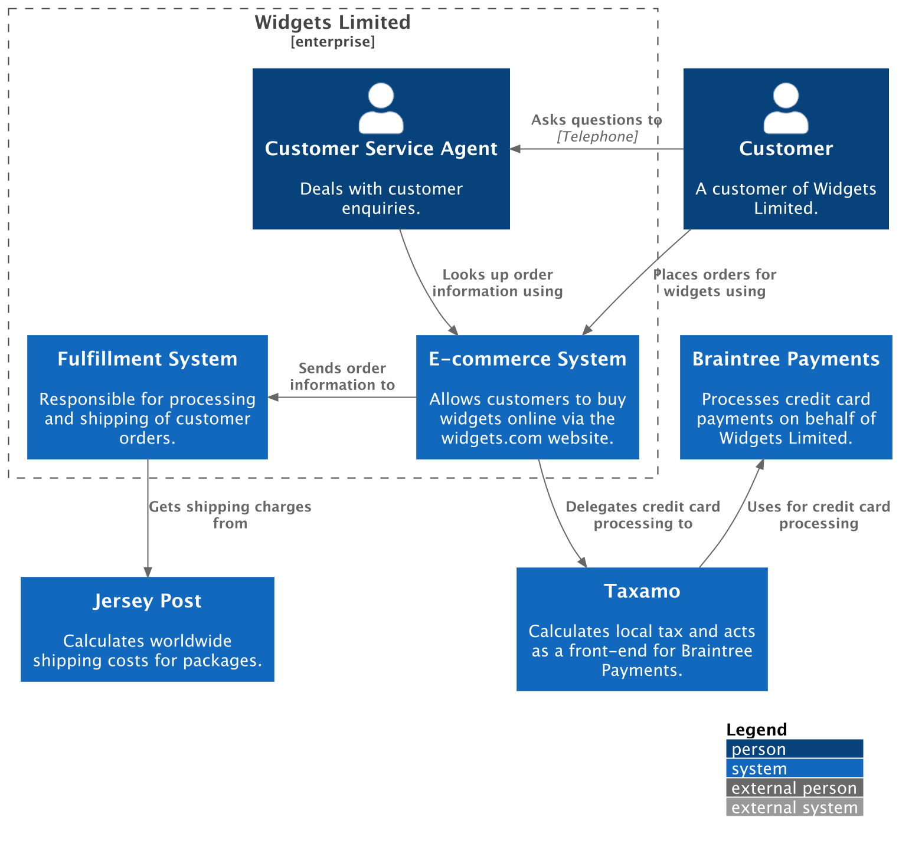

# System context diagram

A system context diagram is a good starting point for diagramming and documenting a software system,
allowing you to step back and see the big picture.
Draw a diagram showing your system as a box in the centre, surrounded by its users and the other systems
that it interacts with.

## Example

The following example demonstrates how to define a **system context diagram** using the Python DSL.

```python
from c4 import (
    EnterpriseBoundary,
    LayDown,
    Person,
    Rel,
    RelDown,
    RelLeft,
    RelRight,
    System,
    SystemContextDiagram,
)
from c4.renderers.plantuml import LayoutOptions


with SystemContextDiagram() as diagram:
    customer = Person(
        "customer", "Customer", "A customer of Widgets Limited."
    )

    with EnterpriseBoundary("c0", "Widgets Limited"):
        csa = Person(
            "csa",
            "Customer Service Agent",
            "Deals with customer enquiries.",
        )

        ecommerce = System(
            "ecommerce",
            "E-commerce System",
            "Allows customers to buy widgets online via the widgets.com website.",
        )

        fulfillment = System(
            "fulfillment",
            "Fulfillment System",
            "Responsible for processing and shipping of customer orders.",
        )

    taxamo = System(
        "taxamo",
        "Taxamo",
        "Calculates local tax and acts as a front-end for Braintree Payments.",
    )

    braintree = System(
        "braintree",
        "Braintree Payments",
        "Processes credit card payments on behalf of Widgets Limited.",
    )

    post = System(
        "post",
        "Jersey Post",
        "Calculates worldwide shipping costs for packages.",
    )

    customer >> RelRight("Asks questions to", technology="Telephone") >> csa
    customer >> RelRight("Places orders for widgets using") >> ecommerce
    csa >> Rel("Looks up order information using") >> ecommerce
    ecommerce >> RelRight("Sends order information to") >> fulfillment
    fulfillment >> RelDown("Gets shipping charges from") >> post
    ecommerce >> RelDown("Delegates credit card processing to") >> taxamo
    taxamo >> RelLeft("Uses for credit card processing") >> braintree

    LayDown(customer, braintree)

    layout_options = LayoutOptions().layout_top_down(with_legend=True)

diagram_code = diagram.as_plantuml(layout_options=layout_options)
```

<details>
<summary>Generated PlantUML source</summary>

```puml

```

</details>

The PlantUML source can be rendered into the following diagram:


