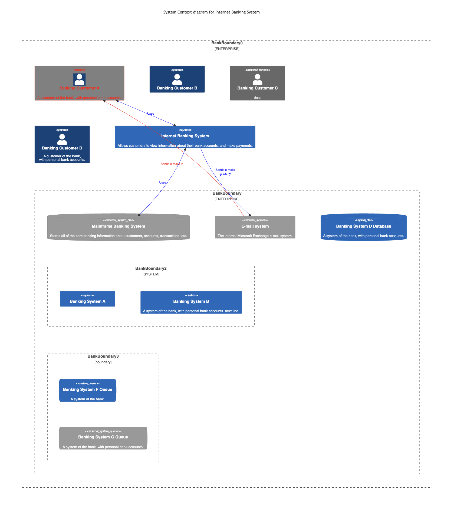
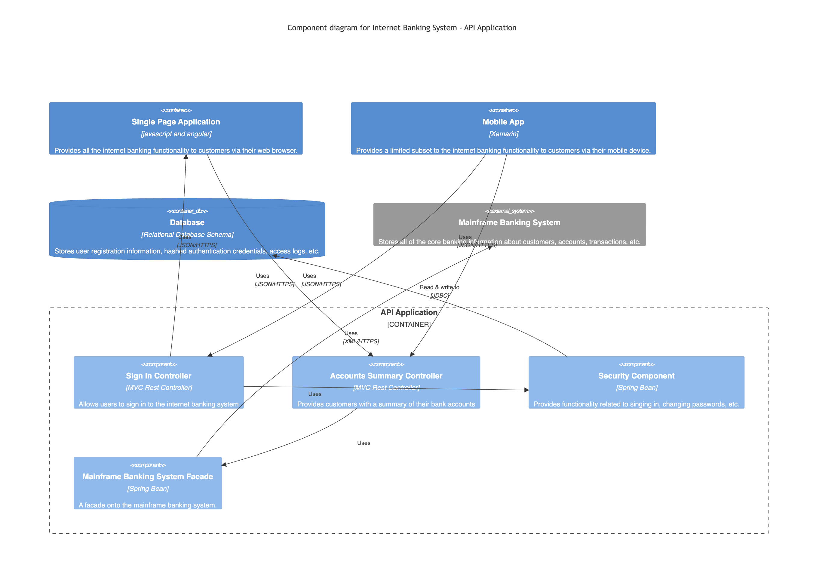
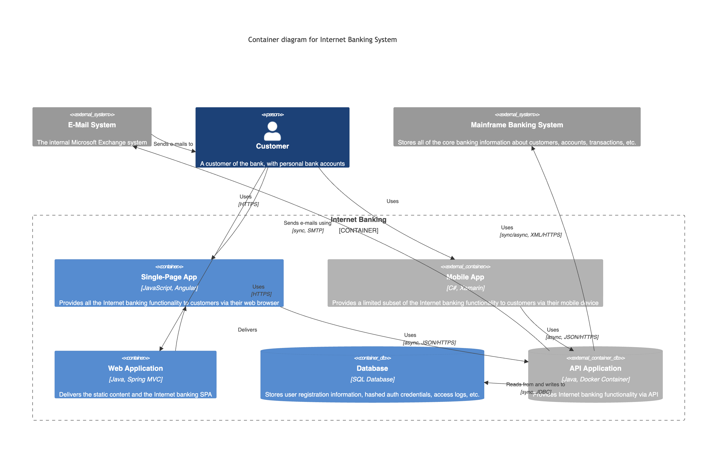
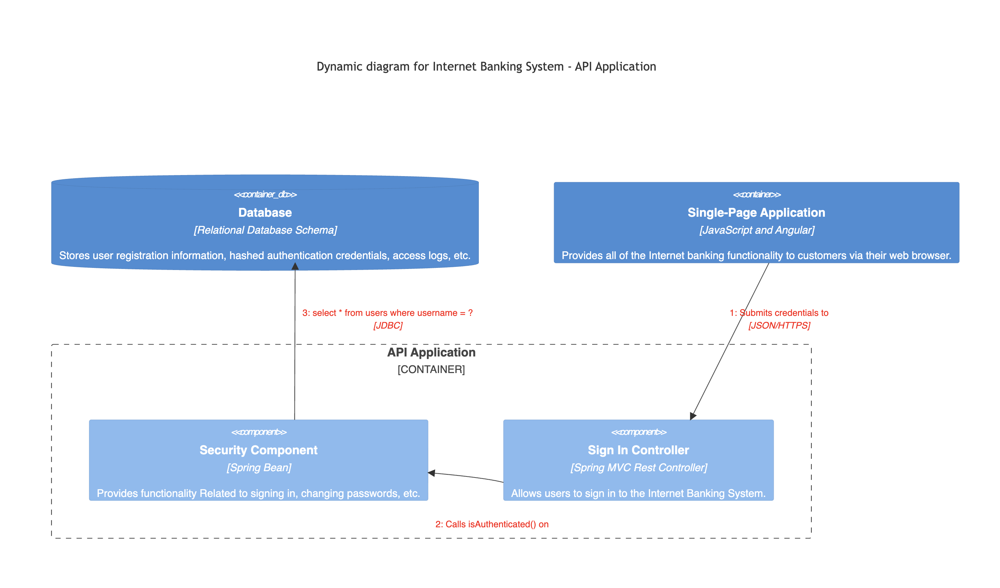
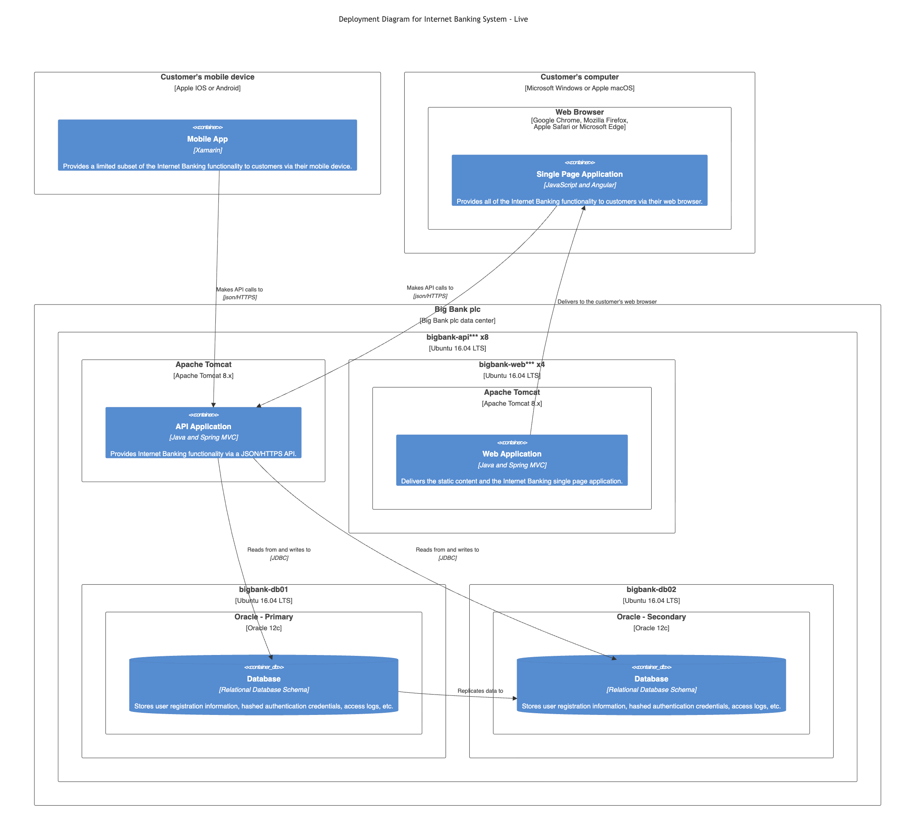

# Mermaid

???+ warning "Mermaid C4 diagram status"

    Mermaid’s C4 diagram support is currently **experimental**.

    According to the official [Mermaid documentation](https://mermaid.js.org/syntax/c4.html):

    >C4 Diagram: This is an experimental diagram for now. The syntax and properties can change in future releases.
    >Proper documentation will be provided when the syntax is stable.

## System Context Diagram

<figure markdown="span">
  
  <figcaption>system-context-diagram.png</figcaption>
</figure>

??? abstract "JSON diagram"

    ```json
    --8<-- "assets/examples/mermaid/system-context-diagram.json"
    ```

??? abstract "Converted Python diagram"

    ```python
    --8<-- "assets/examples/mermaid/system-context-diagram.py"
    ```

??? abstract "Rendered mermaid source"

    ```mmd
    --8<-- "assets/examples/mermaid/system-context-diagram.mmd"
    ```

<br/>

## Component Diagram

<figure markdown="span">
  
  <figcaption>component-diagram.png</figcaption>
</figure>

??? abstract "JSON diagram"

    ```json
    --8<-- "assets/examples/mermaid/component-diagram.json"
    ```

??? abstract "Converted Python diagram"

    ```python
    --8<-- "assets/examples/mermaid/component-diagram.py"
    ```

??? abstract "Rendered mermaid source"

    ```mmd
    --8<-- "assets/examples/mermaid/component-diagram.mmd"
    ```

<br/>

## Container Diagram

<figure markdown="span">
  
  <figcaption>container-diagram.png</figcaption>
</figure>

??? abstract "JSON diagram"

    ```json
    --8<-- "assets/examples/mermaid/container-diagram.json"
    ```

??? abstract "Converted Python diagram"

    ```python
    --8<-- "assets/examples/mermaid/container-diagram.py"
    ```

??? abstract "Rendered mermaid source"

    ```mmd
    --8<-- "assets/examples/mermaid/container-diagram.mmd"
    ```

<br/>

## Dynamic Diagram

<figure markdown="span">
  
  <figcaption>dynamic-diagram.png</figcaption>
</figure>

??? abstract "JSON diagram"

    ```json
    --8<-- "assets/examples/mermaid/dynamic-diagram.json"
    ```

??? abstract "Converted Python diagram"

    ```python
    --8<-- "assets/examples/mermaid/dynamic-diagram.py"
    ```

??? abstract "Rendered mermaid source"

    ```mmd
    --8<-- "assets/examples/mermaid/dynamic-diagram.mmd"
    ```

<br/>

## Deployment Diagram

<figure markdown="span">
  
  <figcaption>deployment-diagram.png</figcaption>
</figure>

??? abstract "JSON diagram"

    ```json
    --8<-- "assets/examples/mermaid/deployment-diagram.json"
    ```

??? abstract "Converted Python diagram"

    ```python
    --8<-- "assets/examples/mermaid/deployment-diagram.py"
    ```

??? abstract "Rendered mermaid source"

    ```mmd
    --8<-- "assets/examples/mermaid/deployment-diagram.mmd"
    ```

<br/>
