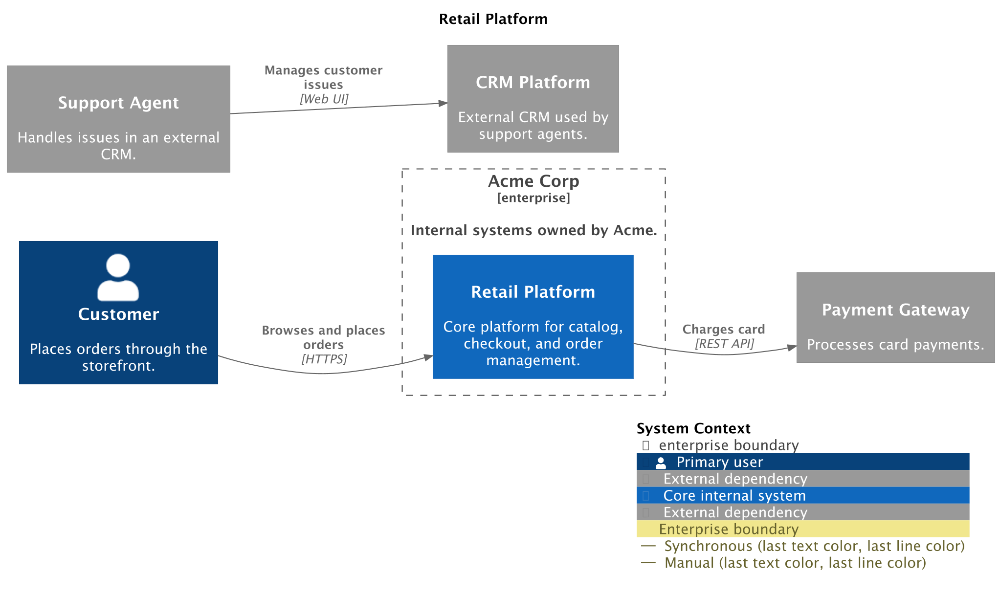
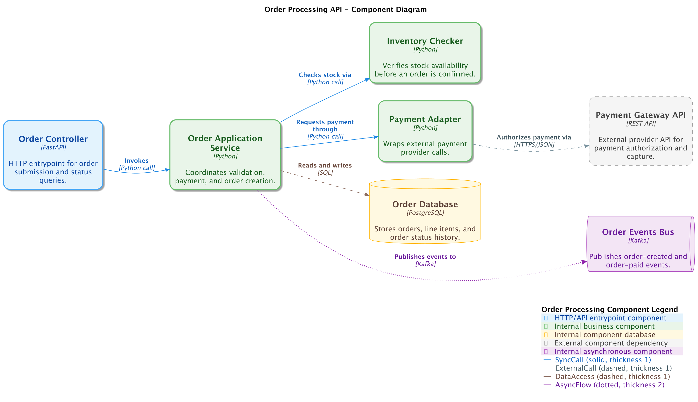
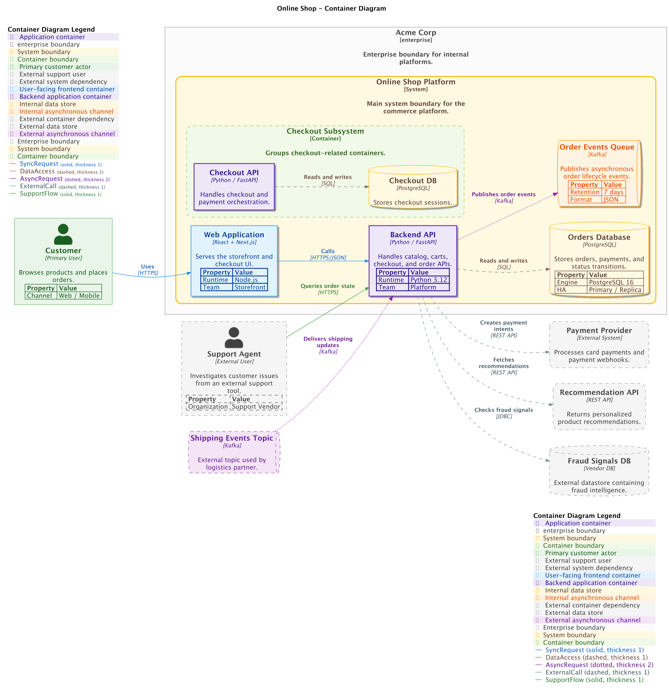
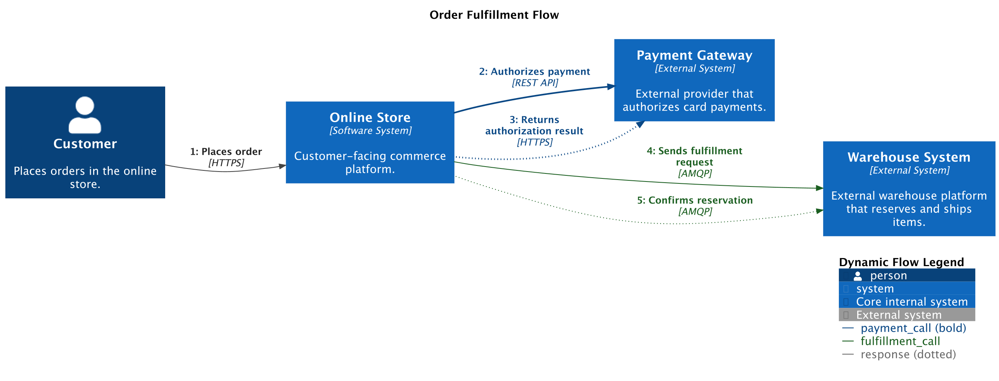
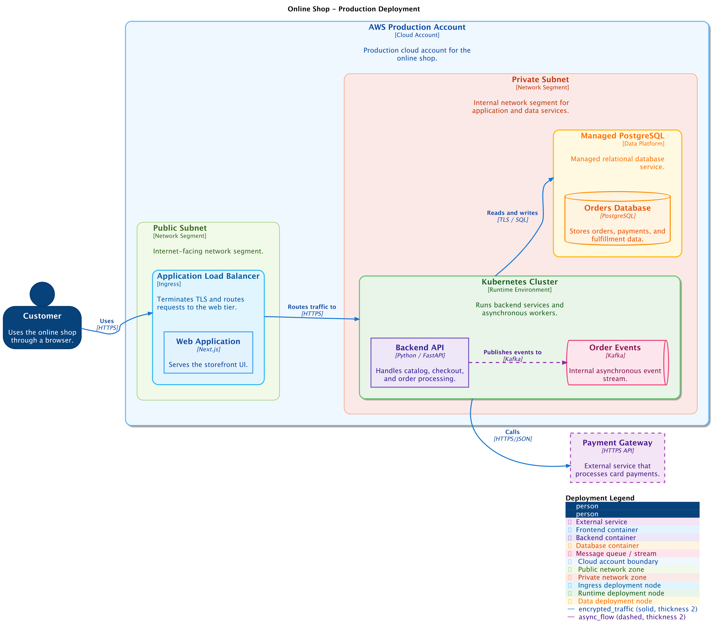

# PlantUML

## System Context Diagram

<figure markdown="span">
  
  <figcaption>system-context-diagram.png</figcaption>
</figure>

??? abstract "JSON diagram"

    ```json
    --8<-- "assets/examples/plantuml/system-context-diagram.json"
    ```

??? abstract "Converted Python diagram"

    ```python
    --8<-- "assets/examples/plantuml/system-context-diagram.py"
    ```

??? abstract "Rendered PlantUML source"

    ```puml
    --8<-- "assets/examples/plantuml/system-context-diagram.puml"
    ```

<br/>

## Component Diagram

<figure markdown="span">
  
  <figcaption>component-diagram.png</figcaption>
</figure>

??? abstract "JSON diagram"

    ```json
    --8<-- "assets/examples/plantuml/component-diagram.json"
    ```

??? abstract "Converted Python diagram"

    ```python
    --8<-- "assets/examples/plantuml/component-diagram.py"
    ```

??? abstract "Rendered PlantUML source"

    ```puml
    --8<-- "assets/examples/plantuml/component-diagram.puml"
    ```

<br/>

## Container Diagram

<figure markdown="span">
  
  <figcaption>container-diagram.png</figcaption>
</figure>

??? abstract "JSON diagram"

    ```json
    --8<-- "assets/examples/plantuml/container-diagram.json"
    ```

??? abstract "Converted Python diagram"

    ```python
    --8<-- "assets/examples/plantuml/container-diagram.py"
    ```

??? abstract "Rendered PlantUML source"

    ```puml
    --8<-- "assets/examples/plantuml/container-diagram.puml"
    ```

<br/>

## Dynamic Diagram

<figure markdown="span">
  
  <figcaption>dynamic-diagram.png</figcaption>
</figure>

??? abstract "JSON diagram"

    ```json
    --8<-- "assets/examples/plantuml/dynamic-diagram.json"
    ```

??? abstract "Converted Python diagram"

    ```python
    --8<-- "assets/examples/plantuml/dynamic-diagram.py"
    ```

??? abstract "Rendered PlantUML source"

    ```puml
    --8<-- "assets/examples/plantuml/dynamic-diagram.puml"
    ```

<br/>

## Deployment Diagram

<figure markdown="span">
  
  <figcaption>deployment-diagram.png</figcaption>
</figure>

??? abstract "JSON diagram"

    ```json
    --8<-- "assets/examples/plantuml/deployment-diagram.json"
    ```

??? abstract "Converted Python diagram"

    ```python
    --8<-- "assets/examples/plantuml/deployment-diagram.py"
    ```

??? abstract "Rendered PlantUML source"

    ```puml
    --8<-- "assets/examples/plantuml/deployment-diagram.puml"
    ```

<br/>
