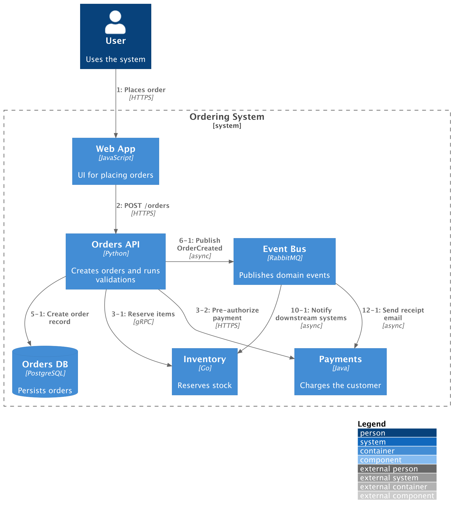

# PlantUML Macros

The **PlantUML** backend supports C4-PlantUML macros used by specific diagram types.

## Dynamic diagram

### Index macros

- [`Index`][c4.diagrams.core.Index]: returns current index and calculates next index
- [`LastIndex`][c4.diagrams.core.LastIndex]: return the last used index
- [`SetIndex`][c4.diagrams.core.SetIndex]: returns new set index and calculates next index

### Helper functions

- [`increment`][c4.diagrams.core.increment]: increase current index
- [`set_index`][c4.diagrams.core.set_index]: set the new index

Example:

```python
from pathlib import Path

from c4 import (
    DynamicDiagram,
    Person,
    SystemBoundary,
    Container,
    ContainerDb,
    Rel,
    RelD,
    RelL,
    RelR,
    Index,
    LastIndex,
    SetIndex,
    increment,
    set_index,
    PNG,
)

from c4.renderers import PlantUMLRenderer
from c4.renderers.plantuml import LocalPlantUMLBackend
from c4.renderers.plantuml import PlantUMLRenderOptionsBuilder

renderer = PlantUMLRenderer(
    backend=LocalPlantUMLBackend(),
    render_options=PlantUMLRenderOptionsBuilder().layout_top_down(with_legend=True).build()
)

with DynamicDiagram() as diagram:
    user = Person("User", "Uses the system")

    with SystemBoundary("Ordering System"):
        web = Container("Web App", "UI for placing orders", technology="JavaScript")
        api = Container("Orders API", "Creates orders and runs validations", technology="Python")
        inventory = Container("Inventory", "Reserves stock", technology="Go")
        payments = Container("Payments", "Charges the customer", technology="Java")
        orders_db = ContainerDb("Orders DB", "Persists orders", technology="PostgreSQL")
        bus = Container("Event Bus", "Publishes domain events", technology="RabbitMQ")

    user >> Rel("Places order", technology="HTTPS", index=Index()) >> web
    web >> Rel("POST /orders", technology="HTTPS", index=Index()) >> api
    api >> RelR("Reserve items", technology="gRPC", index=Index()-1) >> inventory
    api >> RelL("Pre-authorize payment", technology="HTTPS", index=LastIndex()-2) >> payments

    increment()
    api >> RelD("Create order record", index=Index()-1) >> orders_db
    api >> RelR("Publish OrderCreated", technology="async", index=Index()-1) >> bus

    set_index(10)
    bus >> Rel("Notify downstream systems", technology="async", index=Index()-1) >> inventory
    bus >> Rel("Send receipt email", technology="async", index=SetIndex(12)-1) >> payments


renderer.render_file(
    diagram,
    output_path="diagram.png",
    format=PNG,
)
```

This produces the diagram:

<figure markdown="span">
  
  <figcaption>diagram.png</figcaption>
</figure>
