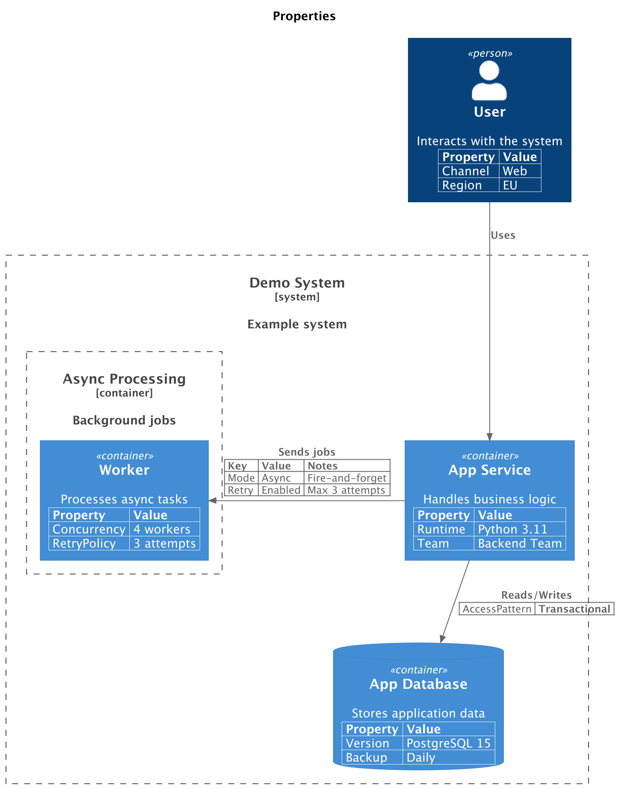

# Properties

A model can be extended with a table of properties to document additional details:

```python
from c4 import (
    Container,
    ContainerBoundary,
    ContainerDb,
    ContainerDiagram,
    Person,
    Rel,
    SystemBoundary,
    RelLeft
)


with ContainerDiagram(title="Properties") as diagram:
    user = Person("User", "Interacts with the system")
    user.add_property("Channel", "Web")
    user.add_property("Region", "EU")

    with SystemBoundary("Demo System", "Example system"):
        app = Container("App Service", "Handles business logic")
        app.add_property("Runtime", "Python 3.11")
        app.add_property("Team", "Backend Team")

        db = ContainerDb("App Database", "Stores application data")
        db.add_property("Version", "PostgreSQL 15")
        db.add_property("Backup", "Daily")

        with ContainerBoundary("Async Processing", "Background jobs"):
            queue = Container("Worker", "Processes async tasks")
            queue.add_property("Concurrency", "4 workers")
            queue.add_property("RetryPolicy", "3 attempts")

    user_app_rel = user >> Rel("Uses") >> app

    app_queue_rel = app >> RelLeft("Sends jobs") >> queue
    app_queue_rel.set_property_header("Key", "Value", "Notes")
    app_queue_rel.add_property("Mode", "Async", "Fire-and-forget")
    app_queue_rel.add_property("Retry", "Enabled", "Max 3 attempts")

    app_db_rel: Rel = app >> Rel("Reads/Writes") >> db
    app_db_rel.add_property("AccessPattern", "Transactional")
    app_db_rel.without_property_header()
```

<br/>

This produces the following diagram:

<figure markdown="span">

  

  <figcaption></figcaption>

</figure>

## API

- `add_property(*args: str)`

    Adds a row to the property table. The number of values must match the number of columns in the header.

- `set_property_header(*args: str)`

    Sets the column headers for the property table.
    This must be called before adding any property rows, unless the new header has
    the same number of columns as the existing rows.
    The default header is `("Property", "Value")`.

- `without_property_header`
   Disables rendering of the header row for the property table.

## Supported elements

Properties can be added to any diagram element or relationship except:

- [`SystemBoundary`](../../api_docs/system-context/#c4.diagrams.system_context.SystemBoundary)
- [`EnterpriseBoundary`](../../api_docs/system-context/#c4.diagrams.system_context.EnterpriseBoundary)
- [`ContainerBoundary`](../../api_docs/container/#c4.diagrams.container.ContainerBoundary)
