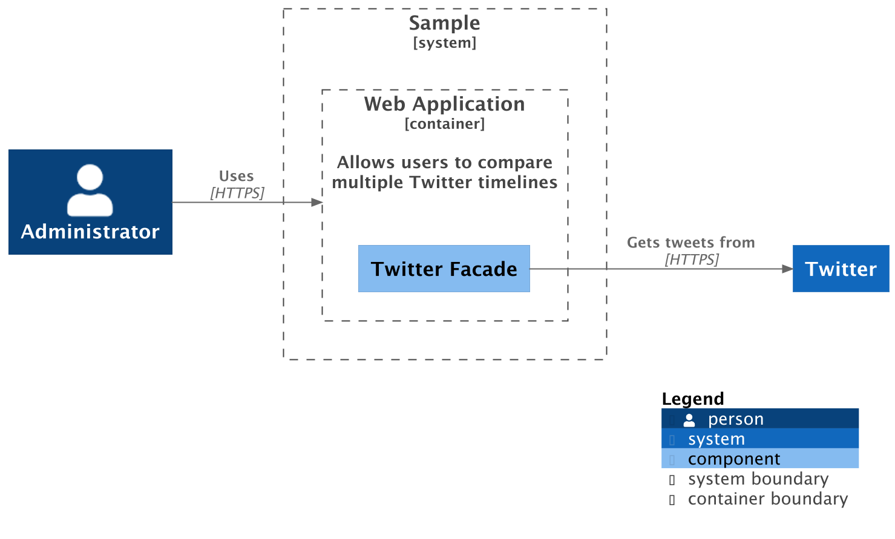
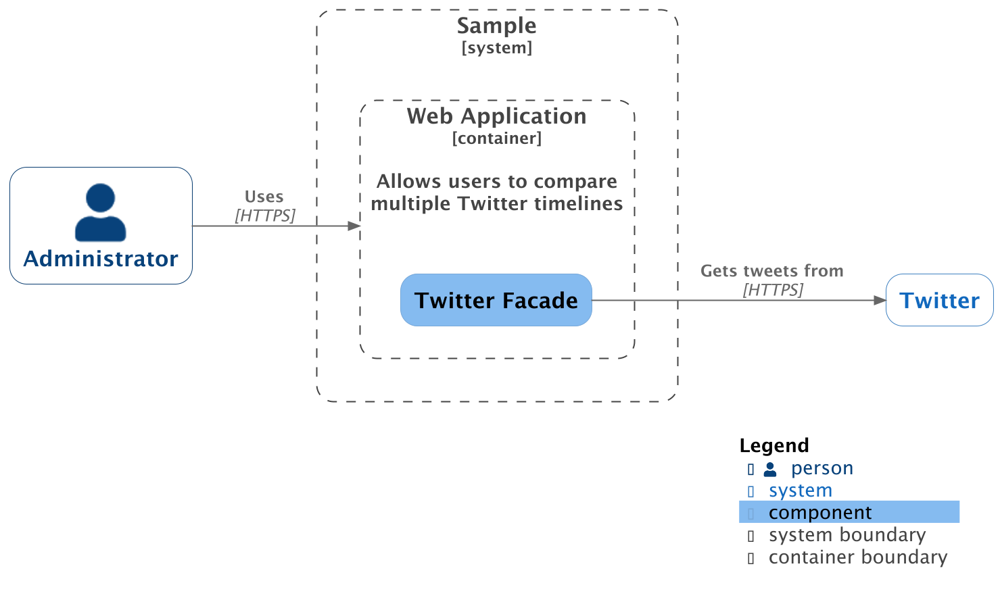

# PlantUML Styles and Options

The **PlantUML** backend supports several layout and styling options that control
diagram direction, legend visibility, and overall visual appearance.

See the [C4-PlantUML docs](https://github.com/plantuml-stdlib/C4-PlantUML/blob/master/LayoutOptions.md)
for additional information.

## Layout Options

Layout behavior is configured via the [`LayoutOptions`][c4.renderers.plantuml.layout_options.LayoutOptions]
builder:

```python
from c4.renderers.plantuml import LayoutOptions

layout_config = (
    LayoutOptions()
    .layout_landscape()   # Horizontal layout
    .show_legend()        # Display legend
    .build()
)
```

You can pass `layout_config` to [`PlantUMLRenderer`][c4.renderers.plantuml.renderer.PlantUMLRenderer].

See the [Layout Options reference][c4.renderers.plantuml.layout_options.LayoutOptions] section for the complete list of
available methods and configuration options.

Layout configuration can also be set via [RenderOptions](../render-options.md).

## C4 Visual Styles

Starting July 2025, the official [c4model.com](https://c4model.com) website introduced
a refreshed visual style for C4 diagrams.

The PlantUML renderer supports both:

- **Classic style (default)**
- **New C4 style (opt-in)**

### Classic Style (Default)

```python
from c4 import *
from c4.renderers.plantuml import PlantUMLRenderer, LocalPlantUMLBackend
from c4.renderers.plantuml import LayoutOptions


with ComponentDiagram() as diagram:
    admin = Person("Administrator")

    with SystemBoundary("Sample"):
        with ContainerBoundary(
            "Web Application",
            "Allows users to compare\nmultiple Twitter timelines",
        ) as web_app:
            twitter_facade = Component("Twitter Facade")

    twitter = System("Twitter")

    admin >> RelRight("Uses", technology="HTTPS") >> web_app
    twitter_facade >> RelRight("Gets tweets from", technology="HTTPS") >> twitter

    layout_config = LayoutOptions().layout_landscape().show_legend().build()

    renderer = PlantUMLRenderer(
        backend=LocalPlantUMLBackend(),
        layout_config=layout_config,
    )


renderer.render_file(
    diagram,
    output_path="diagram.png",
    format=PNG,
)
```

This produces the classic C4 visual style:

<figure markdown="span">
  
  <figcaption>diagram.png</figcaption>
</figure>

### New C4 Style

To enable the updated visual style, pass `use_new_c4_style=True`
to [`PlantUMLRenderer`][c4.renderers.plantuml.renderer.PlantUMLRenderer]:

```python hl_lines="25"
from c4 import *
from c4.renderers.plantuml import PlantUMLRenderer, LocalPlantUMLBackend
from c4.renderers.plantuml import LayoutOptions


with ComponentDiagram() as diagram:
    admin = Person("Administrator")

    with SystemBoundary("Sample"):
        with ContainerBoundary(
            "Web Application",
            "Allows users to compare\nmultiple Twitter timelines",
        ) as web_app:
            twitter_facade = Component("Twitter Facade")

    twitter = System("Twitter")

    admin >> RelRight("Uses", technology="HTTPS") >> web_app
    twitter_facade >> RelRight("Gets tweets from", technology="HTTPS") >> twitter

    layout_config = LayoutOptions().layout_landscape().show_legend().build()

    renderer = PlantUMLRenderer(
        backend=LocalPlantUMLBackend(),
        layout_config=layout_config,
        use_new_c4_style=True,
    )


renderer.render_file(
    diagram,
    output_path="diagram.png",
    format=PNG,
)
```

This produces the updated C4 visual style:

<figure markdown="span">
  
  <figcaption>diagram.png</figcaption>
</figure>
